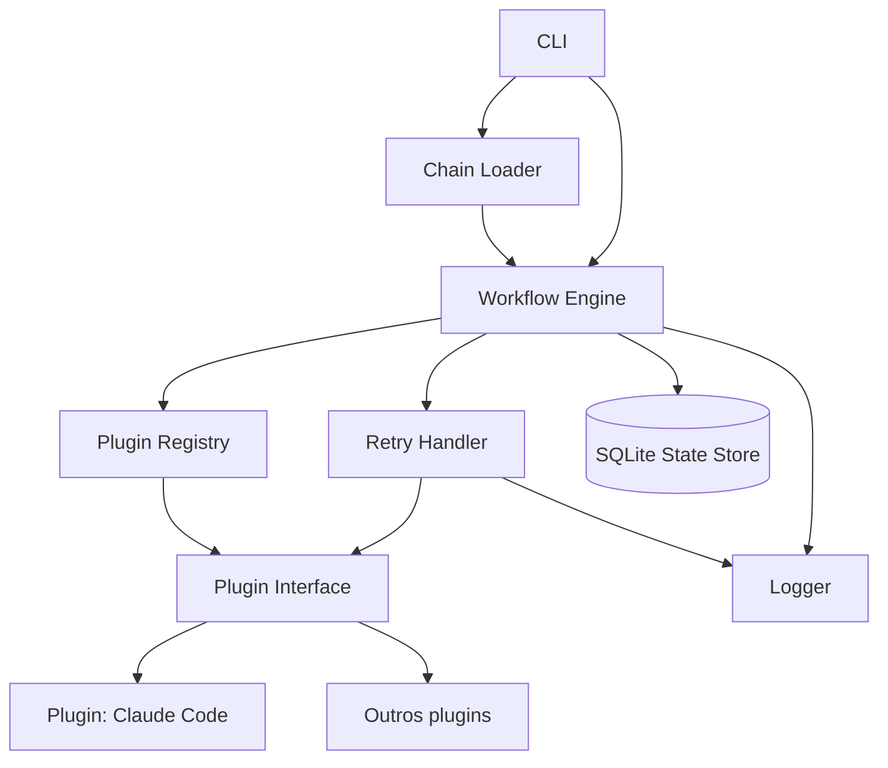

<!-- Front matter de relação: metadado que alimenta o grafo de dependências mantido
pela skill `blueprintfy` (scripts/graph_query.py). Use os nomes exatos das entradas do
CONTEXT-MAP.md em `contextos`/`afeta`. `supera` vai na ADR NOVA (a antiga é marcada
como superada pela ferramenta, não à mão). Mantenha os campos mesmo com lista vazia. -->

# ADR-001: Motor de workflow local com cadeia configurável de plugins Python

- **Status**: Proposto
- **Data**: 2026-08-31
- **Autor**: Gerado a partir de demanda informal (elicitação via skill issue-to-adr)
- **PRD relacionado**: Nenhum — origem é uma demanda informal descrita em conversa, não um documento formal.

## Contexto

Este repositório ainda não existe além do esqueleto atual: a demanda foi levantada
informalmente, sem PRD, como "quero descrever o que esse futuro repositório vai
conter". A elicitação ativa (Fase 1) apurou que se trata de um motor de workflow em
Python, para uso local, que orquestra chamadas a ferramentas externas (Claude Code ou
outras) por meio de um sistema de plugins Python, com o conceito de "chain"
configurável semelhante ao LangChain (RF-01 a RF-07, RNF-01 a RNF-04).

**Assunções registradas durante a elicitação (não confirmadas por dados reais, apenas
por ausência de sinal em contrário):**
- Volume/escala: assumido uso individual e volume muito baixo — não foi perguntado
  diretamente por não haver indicação de que fosse relevante para a decisão.

## Requisitos atendidos

| ID | Requisito | Tipo |
|----|-----------|------|
| RF-01 | Workflows definidos declarativamente (config YAML/JSON) como cadeia ordenada de etapas, referenciando plugins Python + parâmetros | Funcional |
| RF-02 | Cada etapa invoca uma ferramenta externa (ex. Claude Code) via plugin Python | Funcional |
| RF-03 | Descoberta automática de plugins varrendo um diretório local | Funcional |
| RF-04 | Persistência de estado/progresso, permitindo retomar workflow a partir da etapa que falhou | Funcional |
| RF-05 | Retry automático configurável por etapa/plugin em falhas transitórias | Funcional |
| RF-06 | Logging estruturado em JSON | Funcional |
| RF-07 | Output de uma etapa pode opcionalmente alimentar o input da próxima | Funcional |
| RNF-01 | Uso local/single-user, sem concorrência multi-usuário | Não-funcional |
| RNF-02 | Distribuição via clone do repositório (`pip install -e .`), sem PyPI por enquanto | Não-funcional |
| RNF-03 | Estado persistido sobrevive a reinício do processo | Não-funcional |
| RNF-04 | Persistência via SQLite | Não-funcional |

## Decisão

Motor de workflow em Python composto por: CLI, Chain Loader, Workflow Engine, Plugin
Registry, Plugin Interface (contrato), Retry Handler, State Store (SQLite) e Logger.
Workflows são declarados em arquivo de config (YAML/JSON) como uma cadeia ordenada de
etapas; cada etapa referencia um plugin descoberto automaticamente em um diretório
local. A execução é sequencial: para cada etapa, o Engine resolve o plugin, decide o
input (fixo da config ou output da etapa anterior, se configurado), executa através do
Retry Handler (que aplica a política de retry daquela etapa em resposta a
`TransientError`) e persiste o progresso no State Store antes de seguir. Se uma etapa
falhar de forma permanente, a execução para e pode ser retomada depois a partir do
State Store.

**Contrato da Plugin Interface** (in-process, mas tratado como contrato formal por ser
o ponto central de extensão do sistema):
- Todo plugin implementa `run(context) -> output`.
- `context` contém: `input` (output da etapa anterior, ou `None`/valor default se a
  etapa não usa encadeamento), `params` (dict vindo da config daquela etapa), `run_id`
  (identificador da execução do workflow) e `step_name` (id da etapa atual).
- `output`: valor serializável em JSON, persistido no State Store; pode alimentar a
  etapa seguinte quando a config declarar `usa_output_anterior: true`.
- Falha transitória (retriable): plugin levanta `TransientError` (definida na Plugin
  Interface base) — o Retry Handler aplica a política de retry da etapa.
- Qualquer outra exceção é tratada como falha permanente: o Engine marca a etapa como
  `failed`, persiste o estado e interrompe a execução (sem seguir adiante).
- Retry: número de tentativas e backoff são configuráveis por etapa/plugin na config
  do workflow (plugin pode declarar uma política default, sobrescrita pela config).

**Schema do State Store (SQLite)**:
- `workflow_runs`: `run_id` (PK), `workflow_name`, `config_path`, `status`
  (`running`/`completed`/`failed`), `created_at`, `updated_at`.
- `step_executions`: `run_id` (FK), `step_name`, `status`
  (`pending`/`running`/`completed`/`failed`), `attempt_count`, `input` (JSON), `output`
  (JSON), `error_message`, `started_at`, `finished_at`.

## Alternativas consideradas

| Alternativa | Por que não foi escolhida |
|-------------|---------------------------|
| Execução paralela/assíncrona entre etapas | Fora de escopo nesta primeira versão — usuário confirmou execução sequencial por ora; pode ser revisitado em ADR futura sem quebrar o contrato de plugin. |
| Cadeia definida só em código Python (estilo LCEL puro) | Usuário optou por suportar também config declarativa, para não exigir escrever Python só para montar a sequência de etapas. |
| Persistência em arquivo JSON simples | Usuário confirmou SQLite explicitamente, o que também facilita consultas sobre execuções passadas e concorrência de leitura/escrita mínima. |
| Publicação como pacote no PyPI | Fora de escopo agora — uso interno via clone do repositório (RNF-02). |

## Consequências

- **Positivas**: extensibilidade via plugins sem alterar o Engine; retomada de
  workflows falhos evita reprocessamento desnecessário; logging estruturado facilita
  depuração e possível integração futura com observabilidade.
- **Negativas / trade-offs**: execução sequencial limita throughput quando há etapas
  independentes que poderiam rodar em paralelo; SQLite introduz uma dependência de
  schema que precisa de migração se o formato de `step_executions` mudar depois.
- **Riscos**: a convenção de plugin (contrato `run(context)->output` e
  `TransientError`) precisa ser adotada consistentemente por todo plugin futuro —
  qualquer desvio quebra retry e persistência. Volume/escala real não foi validado
  com dados (ver assunção no Contexto); se o uso crescer além do individual, RNF-01
  precisa ser revisitado.

## Componentes afetados

- CLI
- Chain Loader
- Workflow Engine
- Plugin Registry
- Plugin Interface
- Retry Handler
- State Store (SQLite)
- Logger

> Atividades e Acceptance Criteria detalhadas estão em `ADR-001-acs.md`.
