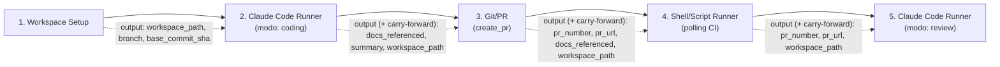

<!-- Front matter de relação: metadado que alimenta o grafo de dependências mantido
pela skill `blueprintfy` (scripts/graph_query.py). Use os nomes exatos das entradas do
CONTEXT-MAP.md em `contextos`/`afeta`. `supera` vai na ADR NOVA (a antiga é marcada
como superada pela ferramenta, não à mão). Mantenha os campos mesmo com lista vazia. -->

# ADR-002: Plugins de prova de conceito — pipeline SDD ponta a ponta (coding + review)

- **Status**: Proposto
- **Data**: 2026-09-03
- **Autor**: Gerado a partir de demanda informal (elicitação via skill issue-to-adr)
- **PRD relacionado**: Nenhum — origem é uma demanda informal descrita em conversa, não um documento formal.

## Contexto

A ADR-001 definiu o motor de workflow (Engine, Chain Loader, Plugin Registry, Plugin
Interface, Retry Handler, State Store, Logger) e o contrato genérico de plugin
(`run(context) -> output`), mas sem plugins concretos. A demanda informal desta ADR é
construir um conjunto mínimo de plugins para provar o conceito ponta a ponta, com um
cenário real: uma documentação Docusaurus (convertida em servidor MCP) contendo PB,
PRD, ADR, AC e Histórias; o workflow deve buscar uma história, implementá-la seguindo
o SDD instalado no repositório-alvo via Claude Code, aguardar checks via polling,
abrir/popular a PR, e disparar uma revisão via Claude Code em nova janela de contexto.

**Assunções registradas durante a elicitação (Fase 1) e seu status atual:**
- A história processada em cada execução é declarada na config do workflow (por
  `historia_id`/slug) — seleção automática da "próxima história pendente" fica fora de
  escopo deste POC (possível extensão futura do Chain Loader). **Ainda uma assunção em
  aberto**, não fechada nesta revisão.
- ~~O Chain Loader (ADR-001) não suporta variáveis compartilhadas entre etapas~~ —
  **fechada nesta revisão**: o Chain Loader é estendido com um bloco `vars:` e
  interpolação `{{ vars.<chave> }}` nos `params` de qualquer etapa (RF-05, ver seção
  Decisão). `historia_id`/`branch_name` deixam de precisar ser duplicados literalmente.
- ~~Conexão MCP à documentação Docusaurus assumida como configurável nativamente,
  não validada~~ — **fechada nesta revisão**: verificado contra a CLI instalada
  (`claude --version` → `2.1.260`). `--mcp-config <path>` carrega servidores MCP de um
  arquivo JSON explícito; achado relevante durante a verificação: servidores vindos de
  um `.mcp.json` de projeto (auto-descoberto) ficam "Pending approval" e não conectam em
  modo não-interativo, então o design usa `--mcp-config` explícito + `--strict-mcp-config`
  (nunca depende do `.mcp.json` de projeto) — ver seção Decisão.
- "Popular informação do PR" foi interpretado como preenchimento estruturado de
  título/corpo/labels via `gh` CLI, não interpolação livre de string no shell (risco de
  injeção).
- Alvo do polling assumido como status de CI/checks da PR recém-aberta, antes de
  disparar a etapa de revisão.
- **Auditabilidade foi levantada explicitamente pelo usuário como requisito
  transversal** (não estava no pedido inicial): toda etapa do pipeline precisa deixar
  rastro suficiente para validação posterior — não apenas "rodou com sucesso".

## Requisitos atendidos

| ID | Requisito | Tipo |
|----|-----------|------|
| RF-01 | Plugin Workspace Setup: prepara workspace local, branch e (opcionalmente) infraestrutura dockerizada antes da codificação | Funcional |
| RF-02 | Plugin Claude Code Runner: invoca Claude Code CLI em dois modos (`coding`, `review`), com MCP nativo apontando pra doc Docusaurus | Funcional |
| RF-03 | Plugin Shell/Script Runner: executa script `.sh`/`.bat` local (polling de CI/checks) | Funcional |
| RF-04 | Plugin Git/PR: cria/atualiza PR via `gh` CLI, populando metadados a partir de templates | Funcional |
| RNF-01 | Logger emite campos de correlação (`historia_id`, `branch`, `pr_number`, `pr_url`) em todo evento relevante, além dos campos já exigidos pela ADR-001 (RF-06) | Não-funcional |
| RNF-02 | Claude Code Runner persiste transcript completo da sessão (`session_log_path` obrigatório, em ambos os modos, mesmo em falha) | Não-funcional |
| RNF-03 | Workspace Setup registra o commit SHA exato da branch base usada (`base_commit_sha`), para reconstrução do estado inicial de cada execução | Não-funcional |
| RNF-04 | Corpo da PR gerada pelo Git/PR contém referência explícita e obrigatória a `historia_id` e aos ids de ADR/AC consultados | Não-funcional |
| RF-05 | Chain Loader (estendido): resolve bloco `vars:` da config e interpolação `{{ vars.<chave> }}` nos `params` de qualquer etapa, antes de repassá-los ao plugin | Funcional |
| RNF-05 (herdado) | Uso local/individual, execução sequencial, sem concorrência multi-usuário (ADR-001 RNF-01) | Não-funcional |

## Decisão

Quatro plugins novos, todos implementando o contrato `run(context) -> output` já
definido na ADR-001, sem alterar Engine, Chain Loader, Plugin Registry ou Retry
Handler. O único componente existente estendido é o **Logger**: além dos campos já
exigidos (`run_id`, `step_name`, `evento`, `timestamp`), passa a emitir um objeto
`correlacao` com qualquer um de `historia_id`/`branch`/`pr_number`/`pr_url` presente
nos `params`/output daquela etapa — isso dá rastreabilidade ponta a ponta (doc → código
→ PR → review) sem exigir migração de schema no State Store.

Cadeia de exemplo do POC (1 história por execução do workflow). A ordem das etapas 3 e 4
foi decidida deliberadamente — **Git/PR vem logo após o coding, antes do polling** — pelo
motivo descrito na convenção de *carry-forward* logo abaixo:



**Convenção de carry-forward (encadeamento multi-hop sem alterar o contrato da ADR-001)**:
o contrato de plugin da ADR-001 só entrega a uma etapa o `output` da etapa *imediatamente*
anterior — não há acesso a outputs de etapas mais distantes. Como a revisão (etapa 5)
precisa de `pr_number`/`pr_url` gerados na etapa 3, e o Git/PR (etapa 3) precisa de
`docs_referenced` gerado na etapa 2, toda etapa intermediária desta cadeia **inclui no
próprio output todos os campos do `input` que recebeu**, com suas próprias chaves novas
tendo precedência em caso de colisão. É por isso que Git/PR foi posicionado logo após o
coding (recebe `docs_referenced` diretamente) em vez de depois do polling — isso evita
precisar de um segundo hop de carry-forward antes de chegar no Git/PR.

**Plugin Workspace Setup**
- `params`: `repo_url` (obrigatório), `branch_base` (obrigatório), `branch_name`
  (obrigatório), `historia_id` (obrigatório, para nomear a branch e correlação),
  `install_cmd` (opcional), `docker_compose_path` (opcional).
- `output`: `workspace_path`, `branch`, `base_commit_sha`, `status` (`ready`).
- Se `docker_compose_path` for informado, sobe os serviços (`docker compose up -d`)
  antes de retornar sucesso; falha na subida é sinalizada como `TransientError`
  (permite retry conforme política da etapa).
- `workspace_path` segue uma **convenção determinística** (não é escolhido livremente a
  cada execução): `<workspaces_root>/<repo_slug>__<historia_id>`, onde `repo_slug` deriva
  de `repo_url` e `workspaces_root` é configuração global do motor (não um `param` por
  etapa). Isso torna o plugin idempotente sob retry (reutiliza o mesmo diretório em vez
  de criar um novo a cada tentativa) e é a base sobre a qual o `session_log_path`
  determinístico do Claude Code Runner é construído.

**Plugin Claude Code Runner** (mesmo plugin, duas instâncias na cadeia via `params.modo`)
- `params` comuns: `modo` (`coding`|`review`, obrigatório), `mcp_config_path`
  (obrigatório). `workdir` **não é um `param`** — em ambos os modos, o plugin lê
  `context.input["workspace_path"]` (chegou via `usa_output_anterior`: direto do
  Workspace Setup no modo `coding`; por carry-forward através de Git/PR e
  Shell/Script Runner no modo `review`).
- `params` modo `coding`: `historia_id` (obrigatório).
- `params` modo `review`: `skill` (obrigatório, ex. `code-review`), `pr_number`/`pr_url`
  (obrigatórios — recebidos via `usa_output_anterior` da etapa Shell/Script Runner, que
  os repassa por carry-forward a partir da etapa Git/PR).
- `output` modo `coding`: `status`, `summary`, `session_log_path`, `docs_referenced`
  (lista de ids de ADR/AC/PRD que o agente efetivamente consultou via MCP durante a
  sessão — obrigatório, mesmo que vazio; é o que alimenta a validação de rastreabilidade
  do Git/PR na etapa seguinte), **+ carry-forward**: todos os campos recebidos em
  `context.input` (nesta cadeia, `workspace_path`/`branch`/`base_commit_sha` vindos do
  Workspace Setup) — necessário porque `workspace_path` não aparece em mais nenhum
  `param` fixo da cadeia; sem repassá-lo, a etapa de revisão (2 hops adiante, via
  Git/PR → Shell/Script Runner) não teria como saber em qual diretório rodar. Achado
  durante a implementação: as seções anteriores desta ADR não deixavam isso explícito.
- `output` modo `review`: `status`, `summary`, `session_log_path` (sem carry-forward —
  é a última etapa da cadeia).
- `session_log_path` é **obrigatório em ambos os modos, mesmo em falha** — é o principal
  rastro auditável de decisões tomadas pela IA.
- Modo `review` sempre inicia uma sessão nova (sem reaproveitar histórico da sessão de
  `coding`), conforme descrito no cenário original.
- **Achado ao preparar um teste real**: nenhum outro plugin da cadeia faz `git
  commit`/`git push` — o Git/PR só cria a PR, assume que a branch já está no remoto.
  O prompt do modo `coding` inclui instrução explícita para commitar e dar push antes
  de retornar, senão a etapa de Git/PR falha por a branch não existir em `origin`.
- `session_log_path` segue uma **convenção de caminho determinístico**, não um valor
  arbitrário retornado pelo plugin: `<workspace_path>/.workflow-logs/<run_id>/<step_name>.log`.
  Isso resolve uma tensão com o contrato da ADR-001 (falha = exceção propagada, sem
  `output` estruturado) — como o caminho é derivável sem depender de um `output` que uma
  etapa falha não produz, o transcript continua auditável mesmo quando o plugin lança
  exceção em vez de retornar.

**Plugin Git/PR**
- `params`: `action` (`create_pr`|`update_pr`, obrigatório), `branch` (obrigatório),
  `base_branch` (obrigatório), `title_template`/`body_template` (obrigatórios),
  `historia_id` (obrigatório — formalizado como `param` explícito em vez de depender
  implicitamente de estar embutido no texto do template renderizado; usado tanto na
  validação de rastreabilidade quanto disponível para o template referenciar), `labels`
  (opcional), `pr_number` (**obrigatório apenas quando `action = "update_pr"`** —
  identifica qual PR atualizar; irrelevante em `create_pr`, que ainda não tem PR).
- `output`: `pr_number`, `pr_url`, `status`, **+ carry-forward**: todos os campos
  recebidos em `context.input` (nesta cadeia, `docs_referenced` vindo da etapa de
  coding), preservados no output para a etapa seguinte poder acessá-los.
- Validação obrigatória antes de criar a PR: o `body_template` renderizado deve conter
  referência explícita a `historia_id` (vem dos `params` desta própria etapa) e aos ids
  em `docs_referenced` (vem de `context.input`, recebido diretamente da etapa de coding
  — por isso a ordem da cadeia importa) — se essas referências não puderem ser
  preenchidas, o plugin falha (falha permanente, não retriable) em vez de abrir uma PR
  sem rastreabilidade.

**Invocação verificada da CLI (`claude` 2.1.260)** — verificada de duas formas: contra
`claude --help` (nomes de flag) e contra **chamadas reais** (`claude -p ...`) rodando de
verdade contra o servidor MCP de `samples/docs-site` (ver `progress.md` para a
evidência completa, incluindo custo/tokens reais):

Modo `coding` (`cwd=workdir`):
```
claude -p "<prompt gerado>" \
  --mcp-config <mcp_config_path> --strict-mcp-config \
  --output-format json \
  --json-schema '{"type":"object","properties":{"summary":{"type":"string"},"docs_referenced":{"type":"array","items":{"type":"string"}}},"required":["summary","docs_referenced"]}' \
  --permission-mode bypassPermissions
```
Modo `review` (`cwd=workdir`, deliberadamente **sem** `-r/--resume`, `-c/--continue` nem
`--fork-session` — é isso que garante sessão nova/janela de contexto limpa):
```
claude -p "<prompt de review>" \
  --mcp-config <mcp_config_path> --strict-mcp-config \
  --output-format json \
  --json-schema '{"type":"object","properties":{"summary":{"type":"string"}},"required":["summary"]}' \
  --permission-mode bypassPermissions
```
- `--strict-mcp-config` é obrigatório: garante que o plugin usa **só** o servidor MCP
  passado explicitamente em `--mcp-config`, nunca um `.mcp.json` de projeto
  auto-descoberto (que fica "Pending approval" e não conecta em modo não-interativo —
  achado da verificação contra a CLI instalada).
- `--json-schema` faz a CLI validar/estruturar o resultado final, eliminando parsing
  ambíguo de texto livre para extrair `docs_referenced` — o agente é instruído (via
  prompt) a listar os ids de ADR/AC/PRD efetivamente consultados via MCP, e a CLI garante
  que o campo existe e tem o tipo certo no JSON de saída. **Verificado com uma chamada
  real**: o envelope de `--output-format json` traz o resultado em `result` como uma
  **string JSON escapada** (`{"result": "{\"summary\": ...}", ...}`), não um objeto
  aninhado — é exatamente o formato que `_parse_result` do plugin espera.
- `--permission-mode bypassPermissions` — **não** `acceptEdits` + `--permission-prompts
  none`, que foi a primeira tentativa e **falhou numa chamada real**: `acceptEdits` só
  pré-aprova edição de arquivo, não chamada de ferramenta MCP; combinado com
  `--permission-prompts none` (que nega, em vez de aprovar, qualquer coisa que exigiria
  decisão), toda chamada `mcp__ai-lup-docs__docs_search` foi negada
  (`permission_denials` não vazio no JSON de saída da CLI). `bypassPermissions` foi a
  correção verificada — mesma chamada, `permission_denials: []`, resposta correta.

**Plugin Shell/Script Runner**
- `params`: `script_path` (obrigatório), `interpreter` (`bash`|`bat`, obrigatório),
  `args` (opcional, lista), `timeout_seconds` (opcional).
- `output`: `exit_code`, `stdout`, `stderr`, **+ carry-forward**: todos os campos
  recebidos em `context.input` (nesta cadeia, `pr_number`/`pr_url`/`docs_referenced`
  vindos da etapa Git/PR), preservados no output para a etapa de review poder acessá-los
  sem um segundo mecanismo de lookup.
- Timeout excedido é tratado como `TransientError` (permite retry — ex. polling que
  ainda não teve tempo de completar).
- Como o script é um processo externo sem acesso direto ao `context` Python, todo campo
  de `context.input` é exposto ao script como **variável de ambiente**, prefixada
  `WORKFLOW_INPUT_<CHAVE_MAIUSCULA>` (ex.: `pr_number` → `WORKFLOW_INPUT_PR_NUMBER`). É
  assim que o script de polling desta cadeia sabe qual PR consultar, sem precisar que
  `pr_number` seja declarado como `param` fixo na config.

**Chain Loader (estendido — RF-05)**: a config do workflow ganha um bloco opcional
`vars:` no nível raiz (ex.: `vars: { historia_id: "HIST-142" }`). Antes de repassar os
`params` de qualquer etapa ao Engine, o Chain Loader resolve ocorrências de
`{{ vars.<chave> }}` dentro de valores string dos `params`, substituindo pelo valor
declarado em `vars`. Se uma etapa referenciar uma chave ausente em `vars`, a validação
falha **antes de qualquer etapa ser executada** (mesmo momento e mesmo tipo de erro que a
validação de plugin inexistente já definida na ADR-001-AC-04) — não em runtime, no meio
da cadeia. Os plugins continuam recebendo `params` já resolvidos (strings literais);
eles não sabem que `vars:` existe — a interpolação é responsabilidade só do Chain Loader,
o contrato `run(context) -> output` da ADR-001 não muda.

### Exemplo de configuração da cadeia (POC)

```yaml
name: implementar-historia-sdd    # campo é 'name', não 'workflow_name' — schema real do YamlJsonChainLoader (ADR-001)

vars:
  historia_id: "HIST-142"
  branch_name: "feature/HIST-142"

steps:
  - name: preparar_ambiente
    plugin: workspace_setup
    usa_output_anterior: false     # primeira etapa, sem input
    params:
      repo_url: "git@github.com:org/app-alvo.git"
      branch_base: "main"
      branch_name: "{{ vars.branch_name }}"
      historia_id: "{{ vars.historia_id }}"
      install_cmd: "npm install"
      docker_compose_path: "./docker/local-deps.compose.yaml"   # opcional
    retry:
      max_attempts: 3
      initial_delay: 10.0
      multiplier: 2.0

  - name: implementar_historia
    plugin: claude_code_runner
    usa_output_anterior: true      # workdir vem de output.workspace_path desta etapa anterior
    params:
      modo: "coding"
      mcp_config_path: "./config/mcp-docusaurus.json"
      historia_id: "{{ vars.historia_id }}"
    retry:
      max_attempts: 2
      initial_delay: 30.0
      multiplier: 2.0

  - name: abrir_pr
    plugin: git_pr
    usa_output_anterior: true      # docs_referenced vem do output desta etapa anterior
    params:
      action: "create_pr"
      branch: "{{ vars.branch_name }}"   # mesma vars da 1ª etapa — sem duplicar valor literal
      base_branch: "main"
      historia_id: "{{ vars.historia_id }}"
      title_template: "[{{ vars.historia_id }}] {{ summary }}"
      body_template: |
        Implementa {{ vars.historia_id }}.

        Docs consultados durante a implementação:
        {{ docs_referenced }}
      labels: ["automated-pr"]
    retry:
      max_attempts: 3
      initial_delay: 15.0
      multiplier: 2.0

  - name: aguardar_checks
    plugin: shell_script_runner
    usa_output_anterior: true      # pr_number/pr_url chegam como env vars WORKFLOW_INPUT_*
    params:
      script_path: "./scripts/poll_ci_checks.sh"
      interpreter: "bash"
      timeout_seconds: 600
    retry:
      max_attempts: 5
      initial_delay: 60.0
      multiplier: 1.0            # backoff fixo de 60s a cada tentativa — polling não precisa crescer exponencialmente

  - name: revisar_pr
    plugin: claude_code_runner
    usa_output_anterior: true      # pr_number/pr_url chegam via carry-forward da etapa anterior
    params:
      modo: "review"
      mcp_config_path: "./config/mcp-docusaurus.json"
      skill: "code-review"
    retry:
      max_attempts: 1              # revisão não é retentada automaticamente — falha aqui é sinal pra intervenção humana
```

**Nota**: campos de `retry` (`max_attempts`, `initial_delay`, `multiplier`) e `name` no
nível raiz seguem o schema real já implementado em `YamlJsonChainLoader`/`RetryPolicy`
(ADR-001) — verificado contra o código em `src/workflow_engine/`, não apenas assumido.

**Notas sobre o exemplo**:
- `workspaces_root` (usado pelo Workspace Setup para montar `workspace_path`) não aparece
  aqui — é configuração global do motor, não desta config de workflow.
- **Duas sintaxes `{{ }}` distintas, com timing e fonte de dados diferentes** — evitar
  confundir: `{{ vars.<chave> }}` é resolvido pelo **Chain Loader**, antes da etapa
  rodar, usando o bloco `vars:` do topo da config (`historia_id`, `branch_name` acima).
  Já `{{ summary }}`/`{{ docs_referenced }}` dentro de `title_template`/`body_template`
  são resolvidos pelo **próprio plugin Git/PR em runtime**, usando `context.input` (o
  output da etapa de coding) — o Chain Loader não sabe renderizar esses, só os `vars.*`.
  Sem sintaxe de filtro (`| join(...)`): um valor lista (como `docs_referenced`) é
  automaticamente unido com `", "` ao ser inserido no template — não é Jinja2, é um
  substituidor simples de `{{ campo }}`, para não puxar uma dependência de templating
  só para o POC.
- "Seguir para a próxima história" (fora de escopo deste POC) significaria rodar esta
  mesma config novamente com `vars.historia_id`/`vars.branch_name` atualizados para a
  próxima história — não há loop automático dentro desta config.

## Alternativas consideradas

| Alternativa | Por que não foi escolhida |
|-------------|---------------------------|
| Plugin dedicado de "MCP Context" (busca a doc antes da etapa de coding) | Descartado — o Claude Code já suporta configuração nativa de servidor MCP; a busca de contexto acontece dentro da própria sessão do Claude Code Runner, sem etapa/plugin extra. |
| Plugin genérico de chamada HTTP/REST | Fora de escopo deste POC — nenhuma etapa do cenário exige chamada REST arbitrária além do que o Git/PR plugin já cobre via `gh` CLI. |
| Plugin dedicado de infraestrutura Docker | Descartado como plugin separado — absorvido como capacidade opcional do Workspace Setup (`docker_compose_path`), já que faz parte de "preparar o ambiente". |
| Manter `historia_id`/`branch_name` duplicados literalmente em cada etapa (decisão inicial do POC) | Revertida nesta revisão — o risco de inconsistência (etapa com valor divergente do resto da cadeia) foi considerado alto o suficiente para justificar a extensão do Chain Loader com `vars:` (RF-05), mesmo sendo uma mudança pequena e aditiva (não quebra configs antigas sem `vars:`). |
| Persistir só um resumo (não o transcript completo) da sessão Claude Code | Rejeitado após o usuário levantar auditabilidade como requisito explícito — resumo não é suficiente para validar depois o que a IA de fato leu/decidiu/alterou. |
| Estender o Plugin Interface da ADR-001 com um accessor `context.get_step_output(step_name)` (lookup no State Store para qualquer etapa já concluída, não só a anterior) | Resolveria o encadeamento multi-hop de forma mais genérica, mas exigiria alterar o contrato central definido na ADR-001, afetando todo plugin existente e futuro. Para o POC, a convenção de carry-forward (repassar `input` dentro do próprio `output`) resolve o mesmo problema sem tocar no contrato — fica registrada aqui como opção a reconsiderar se mais plugins passarem a precisar de lookup não-adjacente. |

## Consequências

- **Positivas**: Engine, Plugin Registry e Retry Handler da ADR-001 não mudam — os 4
  plugins são só implementações do contrato já existente; correlação via Logger dá
  rastreabilidade ponta a ponta sem migração de schema no State Store; `vars:` no Chain
  Loader elimina a duplicação manual de `historia_id`/`branch_name` sem quebrar configs
  antigas (extensão aditiva).
- **Negativas / trade-offs**: volume de logs cresce com os campos de correlação;
  transcript completo do Claude Code Runner pode gerar arquivos grandes por execução;
  duas sintaxes de interpolação `{{ }}` coexistindo (vars do Chain Loader vs. campos de
  `context.input` resolvidos pelo próprio plugin Git/PR) exige atenção de quem escrever
  configs, para não confundir uma com a outra.
- **Riscos**: `gh` CLI e Docker precisam estar instalados e autenticados no ambiente
  local (fora do controle do motor); falha de rede/MCP durante a etapa de coding não
  aparece no State Store (que só vê o resultado final da etapa), apenas no transcript
  em `session_log_path` — quem for auditar precisa saber consultar os dois lugares;
  mudanças futuras nos flags da CLI do Claude Code (`--mcp-config`, `--json-schema`,
  `--permission-mode`) entre versões podem quebrar a invocação verificada nesta ADR —
  vale checar `claude --version`/`--help` ao atualizar a CLI no ambiente de execução.
- **Risco confirmado numa execução real (2026-09-04, PR #1 de
  `ai-lup-poc-target-cli`)**: a cadeia **não trava a execução em `exit_code` não-zero**
  do Shell/Script Runner — isso é o contrato documentado (AC-09..AC-11: `exit_code` é
  dado, não sinal de falha), mas na prática significa que, se `poll_ci_checks.sh`
  retornar `exit_code != 0` (CI falhou, ou — como aconteceu de verdade — o script
  retornou cedo demais por checks ainda não registrados), a etapa de revisão roda
  **mesmo assim**. Na execução real isso não causou dano porque a CI de fato passou
  minutos depois, mas o pipeline não verificou isso — foi timing favorável, não uma
  garantia do desenho. Corrigir isso exigiria a Engine suportar parar/ramificar com
  base no `output` de uma etapa (não só em exceção), o que é uma mudança de contrato
  maior, fora de escopo desta ADR — registrado aqui como limitação conhecida, não
  como algo a resolver silenciosamente depois.

## Componentes afetados

- Plugin Workspace Setup (novo)
- Plugin Claude Code Runner (novo)
- Plugin Shell/Script Runner (novo)
- Plugin Git/PR (novo)
- Logger (estendido — campos de correlação; componente já existente na ADR-001)
- Chain Loader (estendido — resolução de `vars:`; componente já existente na ADR-001)

> Atividades e Acceptance Criteria detalhadas estão em `ADR-002-acs.md`.
