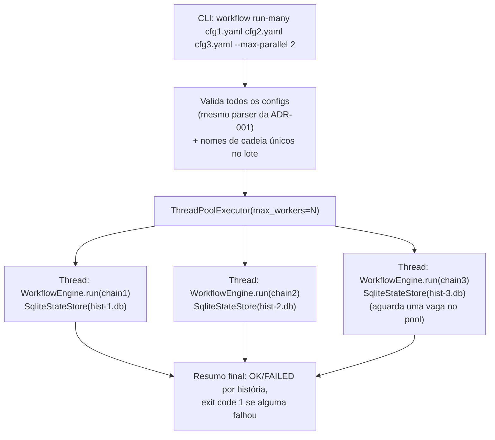

<!-- Front matter de relação: metadado que alimenta o grafo de dependências mantido
pela skill `blueprintfy` (scripts/graph_query.py). Use os nomes exatos das entradas do
CONTEXT-MAP.md em `contextos`/`afeta`. `supera` vai na ADR NOVA (a antiga é marcada
como superada pela ferramenta, não à mão). Mantenha os campos mesmo com lista vazia. -->

# ADR-003: Execuções paralelas independentes do motor de workflow (run-many)

- **Status**: Proposto
- **Data**: 2026-09-04
- **Autor**: Gerado a partir de demanda informal (elicitação via skill issue-to-adr)
- **PRD relacionado**: Nenhum — origem é uma demanda informal descrita em conversa, não um documento formal.

## Contexto

A ADR-001 define o motor como sequencial **dentro de uma execução** (RNF-01: uso
local/individual, sem concorrência multi-usuário) e deixa "execução paralela/assíncrona
entre etapas" fora de escopo. A demanda desta ADR é diferente: não é paralelizar etapas
de uma mesma cadeia, é rodar **múltiplas execuções completas e independentes** ao mesmo
tempo — por exemplo, várias histórias de microsserviços diferentes, que o usuário sabe
de antemão que não se cruzam.

**Assunções registradas durante a elicitação (Fase 1, não confirmadas por dados reais):**
- Nenhuma detecção automática de conflito entre execuções paralelas é feita — o motor
  confia inteiramente na garantia do usuário de que as histórias rodadas juntas são
  independentes (RNF-01 desta ADR). Se essa suposição se mostrar errada na prática
  (histórias que pareciam independentes colidirem em algum recurso), é assunção a
  revisar, não um bug do desenho atual.
- Volume esperado é "algumas" execuções simultâneas (teto pequeno, 2-5), não dezenas —
  não foi dimensionado para volume alto.

## Requisitos atendidos

| ID | Requisito | Tipo |
|----|-----------|------|
| RF-01 | Novo comando `workflow run-many <config...> [--max-parallel N]`: recebe uma lista de configs de cadeia e as executa concorrentemente, respeitando um teto configurável de execuções simultâneas | Funcional |
| RF-02 | Cada execução do lote usa seu próprio arquivo SQLite de State Store, nomeado pelo `name` da cadeia — evita contenção de escrita entre execuções concorrentes | Funcional |
| RF-03 | Falha em uma execução do lote não interrompe as demais — cada uma segue isolada até completar ou falhar por conta própria | Funcional |
| RF-04 | O comando bloqueia até todas as execuções do lote terminarem, reportando um resumo final (quais completaram, quais falharam e por quê) | Funcional |
| RNF-01 | Sem detecção automática de conflito entre execuções paralelas — responsabilidade do usuário | Não-funcional |
| RNF-02 | Teto de concorrência configurável via `--max-parallel` (default pequeno, ex. 3) | Não-funcional |
| RNF-03 (herdado) | Cada execução individual dentro do lote continua sequencial internamente (ADR-001) | Não-funcional |

## Decisão

Novo subcomando `run-many` em `adapters/cli.py` (composition root) — **nenhuma mudança
em `domain/` ou `application/`**. Usa `concurrent.futures.ThreadPoolExecutor`: cada
plugin já delega trabalho pesado a `subprocess.run` (git, `claude`, `gh`, scripts), que
libera o GIL enquanto espera o processo externo — múltiplas threads Python conseguem
ter processos externos rodando de verdade em paralelo, sem precisar de
`multiprocessing` (que exigiria serializar/duplicar registry e conexões).

**Por que isso funciona sem tocar plugins/Engine/RetryHandler**: os 4 plugins da
ADR-002 não guardam estado mutável entre chamadas (`run_command`/`workspaces_root` são
fixados na construção, nunca escritos dentro de `run()`) — a mesma instância de cada
plugin, descoberta **uma vez** por um `FileSystemPluginRegistry` compartilhado, é
segura de chamar a partir de threads concorrentes. `workspace_path` já é
determinístico por `(repo_url, historia_id)` (ADR-002) — histórias independentes
(repos ou historia_id diferentes) já caem em diretórios diferentes sob
`workspaces_root`, sem qualquer mudança de código.

**Isolamento do State Store (RF-02)**: cada execução do lote recebe seu próprio
arquivo `<db-dir>/<chain.name>.db` (default `--db-dir ./run-many-state`), não um
`workflow_state.db` compartilhado. Motivo: SQLite serializa escritas no mesmo arquivo
— múltiplos processos/threads escrevendo o `step_executions` de execuções diferentes
no mesmo arquivo entrariam em contenção (ou erro "database is locked" sem modo WAL) só
por estarem rodando ao mesmo tempo, mesmo sendo logicamente independentes. Isolar por
arquivo elimina essa classe de problema inteira, ao custo de a auditoria de "todas as
execuções" ficar em arquivos separados em vez de uma tabela só — aceitável dado que
cada arquivo já é auditável isoladamente (mesmo schema da ADR-001), e nada impede unir
os `.db` depois se precisar de uma visão agregada.

**Validação antes de disparar qualquer execução**: todos os configs do lote são
carregados e validados primeiro (mesmo `YamlJsonChainLoader`/`ChainValidationError` da
ADR-001); além disso, dois configs do mesmo lote não podem resolver para o mesmo
`chain.name` (ambiguidade de nome de arquivo `.db` e de semântica de retomada) — erro
antes de qualquer thread começar. Um config individual inválido não impede os demais
válidos de rodarem (reportado como falha imediata daquela história no resumo final,
sem consumir uma vaga do pool).

**Retomada**: como cada história do lote já tem seu próprio `.db` nomeado
deterministicamente pelo `chain.name`, uma história que falhou é retomável
isoladamente — tanto rodando `run-many` de novo com o mesmo lote (que vai pular as que
já completaram, igual à retomada de uma execução única na ADR-001) quanto rodando
`workflow run <config> --db <db-dir>/<chain-name>.db` sozinha. **Não existe retomada
de "o lote como um todo"** como conceito — o lote é só a forma de disparar N execuções
independentes de uma vez, não uma unidade de estado própria.

## Alternativas consideradas

| Alternativa | Por que não foi escolhida |
|-------------|---------------------------|
| `multiprocessing` (um processo por execução) em vez de threads | Paralelismo real seria o mesmo (o trabalho pesado já é subprocess), mas exigiria serializar/recriar o `FileSystemPluginRegistry` em cada processo filho e complica o agregamento do resumo final — sem ganho, já que o gargalo é I/O de processo externo, não CPU Python. |
| SQLite compartilhado com modo WAL + retry | Resolveria a contenção de escrita, mas mantém uma dependência de configuração (WAL precisa estar habilitado, retries precisam de backoff) para um ganho só de "auditoria num arquivo só" — isolar por arquivo é mais simples e não introduz esse modo de falha. |
| Detecção automática de conflito (ex.: recusar duas execuções com o mesmo `repo_url`) | Usuário confirmou explicitamente que fica fora de escopo — ele garante independência manualmente; adicionar isso agora seria escopo não pedido. |
| Parar o lote inteiro se uma execução falhar (`--fail-fast` no nível do lote) | Contradiz a premissa de que são histórias independentes — uma falhar não diz nada sobre as outras; forçar parar tudo seria pior para o caso de uso descrito (repos/MS diferentes). |

## Consequências

- **Positivas**: nenhuma mudança em `domain/`/`application/` — só um novo comando no
  composition root (`adapters/cli.py`); reaproveita 100% do `WorkflowEngine`/
  `RetryHandler`/plugins existentes sem modificação; isolamento por arquivo SQLite
  elimina uma classe inteira de bug de concorrência sem precisar de WAL/retry.
- **Negativas / trade-offs**: auditoria de "todas as execuções do lote juntas" exige
  olhar vários arquivos `.db` (ou os `.db` + os CSVs exportados de cada um), não uma
  consulta só; `--max-parallel` alto numa máquina com poucos recursos pode saturar
  CPU/rede/rate-limit da API do Claude sem nenhum aviso do motor (nenhuma lógica de
  backpressure além do teto fixo do pool).
- **Riscos**: se a premissa do usuário sobre independência estiver errada (duas
  histórias do lote afetam o mesmo repo/recurso de fato), o motor não detecta nem
  avisa — corrida de escrita real no filesystem/git aconteceria silenciosamente, sem
  qualquer proteção (decisão consciente, ver Alternativas consideradas); `--max-parallel`
  não tem relação nenhuma com limites de taxa da API do Claude ou do GitHub — um lote
  grande pode esbarrar em rate-limit real da ferramenta externa, não do motor.

## Componentes afetados

- CLI (`adapters/cli.py`) — novo subcomando `run-many`, único ponto tocado.

> Atividades e Acceptance Criteria detalhadas estão em `ADR-003-acs.md`.
