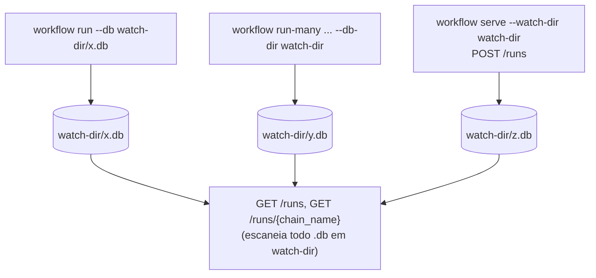

<!-- Front matter de relação: metadado que alimenta o grafo de dependências mantido
pela skill `blueprintfy` (scripts/graph_query.py). Use os nomes exatos das entradas do
CONTEXT-MAP.md em `contextos`/`afeta`. `supera` vai na ADR NOVA (a antiga é marcada
como superada pela ferramenta, não à mão). Mantenha os campos mesmo com lista vazia. -->

# ADR-004: API HTTP e endpoints de monitoria de workflows (workflow serve)

- **Status**: Proposto
- **Data**: 2026-09-04
- **Autor**: Gerado a partir de demanda informal (elicitação via skill issue-to-adr)
- **PRD relacionado**: Nenhum — origem é uma demanda informal descrita em conversa, não um documento formal.

## Contexto

Até aqui, a única porta de entrada do motor é o CLI (`workflow run`/`run-many`, ADR-001/
ADR-003). A demanda desta ADR é abrir uma porta de entrada HTTP para disparar e
monitorar execuções, sem substituir o CLI. Requisito explícito do usuário: a monitoria
precisa enxergar execuções **independentemente de terem sido disparadas pelo terminal
ou pela API** — não pode ser uma monitoria que só vê o que ela mesma iniciou.

Esta ADR cobre só HTTP + monitoria. Streaming ao vivo da sessão do Claude Code e
interação em tempo real com o agente ficam na ADR-005 (dependente desta), por decisão
explícita do usuário de separar as duas — a parte de streaming muda a forma como o
plugin Claude Code Runner invoca a CLI (maior risco), enquanto esta ADR não toca em
nenhum plugin existente.

**Assunções registradas durante a elicitação (Fase 1, não confirmadas):**
- Volume esperado continua baixo/individual (herdado de RNF-01 da ADR-001) — a API não
  foi dimensionada para múltiplos usuários simultâneos, só para múltiplas portas de
  entrada de um mesmo usuário.
- Cancelamento de uma execução via API só é garantido para execuções disparadas pela
  própria API (`serve` tem o handle do processo em memória) — cancelar uma execução
  disparada pelo terminal não é coberto aqui (o jeito de cancelar essa continua sendo
  Ctrl+C no processo do CLI). Isso é assunção/limitação explícita, não esquecimento.

## Requisitos atendidos

| ID | Requisito | Tipo |
|----|-----------|------|
| RF-01 | Novo comando `workflow serve --port N`: novo composition root que sobe um servidor HTTP, sem substituir `run`/`run-many` | Funcional |
| RF-02 | `POST /runs`: dispara uma execução de forma assíncrona (responde na hora com identificador, não espera terminar) | Funcional |
| RF-03 | `GET /runs`: lista execuções conhecidas, agregando todos os arquivos `.db` de um diretório observado (`--watch-dir`) — inclui execuções disparadas por `workflow run`/`run-many` no terminal, desde que apontem `--db`/`--db-dir` para esse mesmo diretório | Funcional |
| RF-04 | `GET /runs/{chain_name}`: detalhe de uma execução (status por etapa, timestamps, erro se houver) | Funcional |
| RF-05 | `POST /runs/{chain_name}/cancelar`: aborta uma execução — garantido apenas para execuções disparadas pela própria API | Funcional |
| RNF-01 (herdado) | Uso local/individual — sem autenticação/multi-tenant nesta versão | Não-funcional |
| RNF-02 | Contrato de erro HTTP uniforme (`{"error": {"code", "message"}}`) em todos os endpoints | Não-funcional |
| RNF-03 | `POST /runs` é protegido contra disparo duplicado concorrente do mesmo `chain_name` (409, não corrida silenciosa no SQLite) | Não-funcional |

## Decisão

Novo composition root `adapters/http_api.py`, comando `workflow serve`. Framework:
**FastAPI + Uvicorn** — dá suporte nativo a rotas assíncronas e a `StreamingResponse`
(usado na ADR-005 para SSE), com pouco código de infraestrutura. Reaproveita
`WorkflowEngine`/`FileSystemPluginRegistry`/`YamlJsonChainLoader`/`SqliteStateStore`
exatamente como `run-many` (ADR-003): cada execução disparada via `POST /runs` roda em
sua própria thread, com seu próprio arquivo `<watch-dir>/<chain_name>.db` — mesma
convenção de isolamento por `chain_name` já estabelecida.

**Convenção que faz a monitoria enxergar terminal e HTTP igualmente**: `serve` não
"possui" as execuções que monitora — ele só **observa um diretório** (`--watch-dir`,
default `./run-many-state`, mesmo default de `run-many`). Qualquer arquivo `.db`
naquele diretório (schema `workflow_runs`/`step_executions` da ADR-001) aparece na
monitoria, tenha sido criado por `serve`, por `run-many`, ou por um `workflow run
--db <watch-dir>/<nome>.db` manual no terminal. Não há acoplamento entre "quem disparou"
e "quem pode ver" — só uma convenção de onde os arquivos ficam.

### Contrato HTTP

Erro uniforme em todo endpoint desta ADR: status HTTP apropriado + corpo
`{"error": {"code": "<slug>", "message": "<texto>"}}`.

**`POST /runs`**
- Corpo: `{"config_path": "<caminho .yaml/.yml/.json, local ao servidor>"}` — `config_path` obrigatório (string).
- 202 Accepted: `{"chain_name": "<nome resolvido da cadeia>", "status": "started"}`. Identificador primário é `chain_name` (não `run_id`) porque o arquivo `.db` já é nomeado por ele (ADR-003) e `run_id` só existe depois que a execução começa de fato dentro da thread — evita expor uma corrida "responder antes do run_id existir".
- 400 (`code: "invalid_config"`) se `config_path` não existir ou a cadeia for inválida (mesma validação da ADR-001/003).
- **409 (`code: "already_running"`)** se já existe uma execução em andamento (não terminada) para aquele `chain_name` — obrigatório (RNF-03): duas requisições concorrentes pro mesmo `chain_name` **não** podem virar duas chamadas a `WorkflowEngine.run()` ao mesmo tempo sobre o mesmo arquivo `.db` (corrida real de leitura/escrita do `get_incomplete_run`/`create_run`). Controlado por um conjunto em memória de `chain_name`s ativos, protegido por lock, checado antes de submeter ao pool de threads.

**`GET /runs`**
- 200: `[{"chain_name", "run_id", "status", "created_at", "updated_at", "source_db"}]` — um item por arquivo `.db` em `--watch-dir` (usa a linha mais recente de `workflow_runs` daquele arquivo). `source_db` é o nome do arquivo, para quem quiser inspecionar diretamente.

**`GET /runs/{chain_name}`**
- 200: `{"chain_name", "run_id", "status", "created_at", "updated_at", "steps": [{"step_name", "status", "attempt_count", "started_at", "finished_at", "error_message"}]}`. `input`/`output` de cada etapa só entram se `?include=io` for passado (evita payload grande por padrão — os JSONs de `session_log_path`/`docs_referenced` etc. podem ser grandes).
- 404 (`code: "not_found"`) se não existir `<watch-dir>/<chain_name>.db`.

**`POST /runs/{chain_name}/cancelar`**
- 200: `{"chain_name", "status": "cancelling"}` — só funciona se a execução foi disparada por este processo `serve` (handle do processo/thread em memória). Mata a etapa em andamento (`Popen.terminate()`/equivalente) e marca a run como `failed` no `.db`.
- 409 (`code: "not_cancellable"`) se a execução não foi disparada por este processo `serve` (ex.: foi um `workflow run` no terminal) — mensagem explica que o cancelamento nesse caso é feito interrompendo o processo do CLI diretamente.
- 404 (`code: "not_found"`) se `chain_name` não existe em nenhuma execução conhecida.

## Alternativas consideradas

| Alternativa | Por que não foi escolhida |
|-------------|---------------------------|
| Flask (sync) | FastAPI dá `StreamingResponse`/rotas async nativamente, que a ADR-005 (SSE) precisa; começar com Flask significaria trocar de framework na próxima ADR. |
| stdlib `http.server` (sem dependência nova) | Reduziria dependências, mas exigiria escrever roteamento, parsing de JSON, SSE e concorrência manualmente — custo maior que adicionar FastAPI+Uvicorn para o que a ADR-005 já vai precisar. |
| `serve` "dono" das execuções que monitora (só vê o que ele mesmo disparou) | Contradiz requisito explícito do usuário — precisa enxergar execuções do terminal também. |
| Identificador primário = `run_id` (gerado só dentro do `WorkflowEngine.run()`) | Geraria uma corrida entre responder o `POST /runs` e o `run_id` existir de fato (thread ainda não começou); `chain_name` já é estável e único (validado na ADR-003) desde a submissão. |
| Deixar disparo duplicado do mesmo `chain_name` correr livre (sem 409) | Duas chamadas concorrentes de `WorkflowEngine.run()` sobre o mesmo arquivo SQLite têm corrida real em `get_incomplete_run`/`create_run` — puro acidente de dado corrompido, não um trade-off aceitável. |

## Consequências

- **Positivas**: reaproveita 100% do `WorkflowEngine`/plugins/State Store das ADRs
  001-003, sem tocar em nenhum plugin; a convenção de "diretório observado" desacopla
  totalmente disparo de monitoria — resolve o requisito de "ver ambos" sem qualquer
  mecanismo novo de sincronização entre CLI e API.
- **Negativas / trade-offs**: usuário precisa lembrar de apontar `--db`/`--db-dir` do
  `workflow run` para dentro do `--watch-dir` do `serve` se quiser aquela execução
  monitorável — não é automático (execuções com o `--db` default antigo,
  `./workflow_state.db`, não aparecem em `GET /runs` a menos que o usuário mude o
  caminho); cancelamento é assimétrico (funciona via API, não via terminal) — decisão
  consciente, não uma limitação escondida.
- **Riscos**: nenhuma autenticação (RNF-01 herdado) — expor `--port` além de
  `localhost` sem proteção adicional seria um risco real, fora de escopo desta ADR
  tratar; leitura de múltiplos `.db` em `GET /runs` pode ficar lenta se o diretório
  acumular muitos arquivos ao longo do tempo (sem paginação nesta versão).

## Componentes afetados

- CLI/API (`adapters/http_api.py`, novo) — único componente novo desta ADR.

> Atividades e Acceptance Criteria detalhadas estão em `ADR-004-acs.md`.
