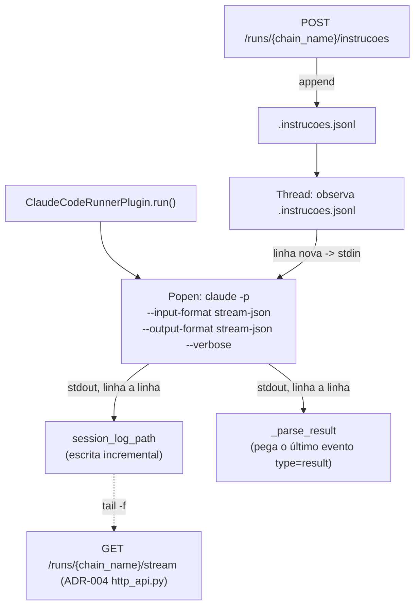

<!-- Front matter de relação: metadado que alimenta o grafo de dependências mantido
pela skill `blueprintfy` (scripts/graph_query.py). Use os nomes exatos das entradas do
CONTEXT-MAP.md em `contextos`/`afeta`. `supera` vai na ADR NOVA (a antiga é marcada
como superada pela ferramenta, não à mão). Mantenha os campos mesmo com lista vazia. -->

# ADR-005: Streaming ao vivo e interação em tempo real com o agente (Claude Code Runner)

- **Status**: Proposto
- **Data**: 2026-09-04
- **Autor**: Gerado a partir de demanda informal (elicitação via skill issue-to-adr)
- **PRD relacionado**: Nenhum — origem é uma demanda informal descrita em conversa, não um documento formal.

## Contexto

A ADR-004 abriu a porta de entrada HTTP e a monitoria; esta ADR cobre a parte que o
usuário pediu separadamente por ser mais arriscada: "ver o agente codificando" ao vivo
e poder "interagir se necessário" enquanto ele roda. Isso muda como o **Claude Code
Runner** (ADR-002) invoca a CLI — hoje é `subprocess.run` bloqueante, que só devolve
tudo de uma vez ao final; para transmitir ao vivo e aceitar uma instrução nova no meio,
o processo precisa ficar de pé com stdin/stdout abertos.

**Verificado ao vivo nesta sessão** (não é suposição): `claude -p --input-format
stream-json --output-format stream-json --verbose --permission-mode bypassPermissions`
aceita uma segunda mensagem de usuário escrita no stdin **enquanto a primeira ainda
está sendo processada**, e o agente realmente muda de direção em resposta a ela — foi
testado mandando "conte de 1 a 5 devagar" e, no meio, "pare, responda só
INTERROMPIDO"; o agente parou de contar e respondeu conforme a nova instrução.

Requisito explícito do usuário (mesmo desta ADR-004): o mecanismo de stream/instrução
precisa funcionar **igual para execuções disparadas por `serve`, por `run` ou por
`run-many`** — não pode depender de estado em memória de um processo específico
(descartado nesta ADR em favor de arquivos com caminho determinístico, mesma
convenção já usada para `session_log_path` na ADR-002).

**Assunções registradas durante a elicitação (Fase 1, não confirmadas):**
- A composição de `--json-schema` com `--output-format stream-json` **não foi testada
  ao vivo** nesta sessão — só `--output-format json` (sem streaming) foi testado com
  `--json-schema`, e só `--output-format stream-json` (sem `--json-schema`) foi testado
  para a interação em tempo real. Assumido que o evento final `type:"result"` do modo
  streaming carrega o mesmo formato (`result` como string JSON escapada) validado
  contra o schema — **a confirmar durante a implementação**, com uma chamada real
  combinando os dois antes de considerar T-01 pronta.
- Interação só é aceita enquanto uma etapa `claude_code_runner` está com status
  "running" para aquele `chain_name` — não vira fila para uma sessão futura.
- Cancelamento de uma sessão em streaming reusa o endpoint já definido na ADR-004
  (`POST /runs/{chain_name}/cancelar`), não é redefinido aqui.

## Requisitos atendidos

| ID | Requisito | Tipo |
|----|-----------|------|
| RF-01 | Claude Code Runner (modos `coding`/`review`) passa a invocar o `claude` via processo de longa duração (`Popen`, stdin/stdout abertos), usando `--input-format stream-json --output-format stream-json --verbose` — contrato de `params`/`output` do plugin (ADR-002) não muda | Funcional |
| RF-02 | `session_log_path` é escrito incrementalmente (linha a linha), não só ao final — "tailable" em tempo real | Funcional |
| RF-03 | Enquanto a sessão está ativa, o plugin observa um arquivo de instruções (caminho determinístico) e repassa cada linha nova para o stdin do processo `claude` | Funcional |
| RF-04 | Novo endpoint `GET /runs/{chain_name}/stream` (SSE) em `adapters/http_api.py` (ADR-004): retransmite ao vivo o conteúdo de `session_log_path` da etapa `claude_code_runner` ativa | Funcional |
| RF-05 | Novo endpoint `POST /runs/{chain_name}/instrucoes`: acrescenta uma instrução ao arquivo de instruções da etapa ativa | Funcional |
| RNF-01 | Mecanismo funciona identicamente para execuções disparadas por `serve`, `run` ou `run-many` — baseado em arquivo, não em estado de processo em memória | Não-funcional |
| RNF-02 | Sem etapa `claude_code_runner` ativa, `GET /stream`/`POST /instrucoes` respondem erro claro (409), nunca um stream vazio/travado | Não-funcional |
| RNF-03 (herdado) | `Plugin.run(context) -> output` / `TransientError` (ADR-001) não muda | Não-funcional |

## Decisão

**Claude Code Runner reescrito internamente** (mesmo arquivo, `plugins/
claude_code_runner.py`; mesmo `params`/`output` documentado na ADR-002 — só a
implementação de `_invoke_cli` muda):

- **Caminhos determinísticos** (mesma convenção da ADR-002, agora com um segundo
  arquivo irmão):
  - `session_log_path` = `<workspace_path>/.workflow-logs/<run_id>/<step_name>.log`
    (já existente, ADR-002) — agora escrito **incrementalmente**, uma linha por
    evento recebido do processo, não só num `finally` ao final.
  - `instructions_path` = `<workspace_path>/.workflow-logs/<run_id>/<step_name>.instrucoes.jsonl`
    — arquivo novo, criado vazio quando a sessão começa, apagado/ignorado quando termina.
- **Por que arquivo, não memória** (RNF-01): um `workflow run` no terminal e o
  processo `serve` são processos do SO diferentes. Um handle de `Popen`/fila em
  memória só existe dentro do processo que o criou. Um arquivo no disco, com caminho
  derivável a partir de `workspace_path`+`run_id`+`step_name` (todos já disponíveis
  via State Store, ver ADR-004), é a única forma simples de tornar isso
  cross-processo sem introduzir socket/named pipe.
- **Como `serve` (ADR-004) encontra esses caminhos**: lê `workflow_runs.config_path`
  do `.db` daquele `chain_name`, recarrega a definição da cadeia
  (`YamlJsonChainLoader`, já existente), identifica qual etapa em `step_executions`
  está com `status="running"` e cujo `plugin` naquela definição é
  `claude_code_runner`; extrai `workspace_path` do `input` daquela etapa (carregado
  por carry-forward, convenção já estabelecida na ADR-002); monta os dois caminhos.
  Se nenhuma etapa "running" for `claude_code_runner`, não há sessão pra
  transmitir/instruir (AC-07/AC-09).
- **Repasse de instrução pro processo vivo**: uma thread do plugin faz polling do
  `instructions_path` (linha nova = uma instrução); cada linha nova vira
  `{"type":"user","message":{"role":"user","content":"<linha>"}}` escrito no stdin do
  processo `claude` — exatamente o formato verificado ao vivo nesta sessão.
- **`GET /runs/{chain_name}/stream` (SSE)**: dado o `session_log_path` resolvido,
  faz `tail -f` (lê o que já existe, depois continua lendo linhas novas conforme
  aparecem) e emite cada linha como um evento SSE (`data: <linha>\n\n`).
- **`POST /runs/{chain_name}/instrucoes`**: corpo `{"mensagem": "<texto>"}`; resolve
  `instructions_path` do mesmo jeito, acrescenta uma linha; responde 202 (aceito, não
  espera o agente processar).

## Alternativas consideradas

| Alternativa | Por que não foi escolhida |
|-------------|---------------------------|
| WebSocket (canal único bidirecional) | Usuário pediu SSE explicitamente para "ver"; um endpoint HTTP comum (`POST /instrucoes`) cobre "mandar instrução" sem precisar de um protocolo novo — dois canais unidirecionais simples em vez de um bidirecional. |
| Session Registry em memória, dentro do processo `serve` | Só funcionaria para execuções disparadas pelo próprio `serve` — quebra o requisito explícito de enxergar/interagir também com execuções do terminal. Descartado em favor do mecanismo por arquivo. |
| Named pipe / socket Unix por sessão | Resolveria o cross-processo também, mas exige código específico de plataforma (Windows não tem named pipes POSIX) — polling de arquivo é portátil e suficiente para uso local/individual (latência de polling é aceitável, não é um sistema de baixa latência). |
| Manter `subprocess.run` bloqueante e só "tail -f" o log ao final | Não permite interação em tempo real (RF-03) nem stream de verdade — só um "replay" depois que a sessão já terminou. |

## Consequências

- **Positivas**: nenhuma mudança de contrato do plugin visível ao Engine (`params`/
  `output` idênticos à ADR-002); mecanismo por arquivo funciona igual para qualquer
  entry point (CLI ou HTTP), sem sincronização nova entre processos; interação
  verificada com uma chamada real, não é suposição de que a CLI suporta.
- **Negativas / trade-offs**: polling de arquivo para instruções introduz latência
  (não é instantâneo como um socket — aceitável para uso local/individual, mas real);
  dois arquivos por etapa `claude_code_runner` agora (log + instruções) em vez de um;
  `serve` precisa recarregar a definição da cadeia a cada chamada de `/stream`/
  `/instrucoes` para saber qual etapa é `claude_code_runner` (custo pequeno, mas é
  I/O extra por requisição).
- **Riscos**: a composição `--json-schema` + `--output-format stream-json` não foi
  verificada ao vivo (ver Contexto) — se o formato do evento final for diferente do
  assumido, `_parse_result` precisa de ajuste na implementação; polling de arquivo
  para detectar linha nova pode perder uma instrução se duas chegarem entre dois
  ciclos de poll rápidos demais (mitigável lendo todo o delta desde a última posição
  lida, não só a última linha).

## Componentes afetados

- Plugin Claude Code Runner (`plugins/claude_code_runner.py`, ADR-002) — reescrita
  interna da invocação, contrato externo inalterado.
- API HTTP (`adapters/http_api.py`, ADR-004) — dois endpoints novos.

> Atividades e Acceptance Criteria detalhadas estão em `ADR-005-acs.md`.
