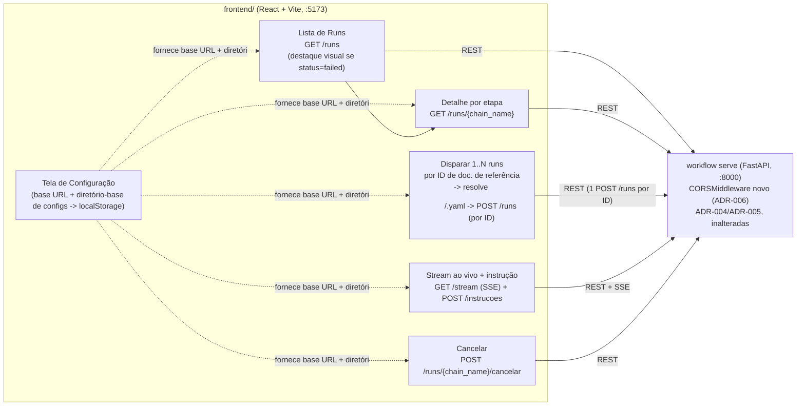

<!-- Front matter de relação: metadado que alimenta o grafo de dependências mantido
pela skill `blueprintfy` (scripts/graph_query.py). Use os nomes exatos das entradas do
CONTEXT-MAP.md em `contextos`/`afeta`. `supera` vai na ADR NOVA (a antiga é marcada
como superada pela ferramenta, não à mão). Mantenha os campos mesmo com lista vazia. -->

# ADR-006: Frontend v1 — painel de controle, visualização e interação com o motor via REST

- **Status**: Proposto
- **Data**: 2026-09-04
- **Autor**: Gerado a partir de demanda informal (elicitação via skill issue-to-adr)
- **PRD relacionado**: Nenhum — origem é uma demanda informal descrita em conversa, não um documento formal.

## Contexto

A ADR-004 abriu a porta HTTP (`workflow serve`) e a ADR-005 acrescentou stream ao vivo
e interação com o Claude Code Runner — mas ambas só têm cliente via `curl`/HTTP direto.
O usuário pediu explicitamente uma primeira versão de **frontend** para controlar
(disparar/cancelar runs), visualizar (listar runs, ver detalhe por etapa) e interagir
(mandar instrução, ver stream ao vivo) com o motor, tudo consumindo a API REST/SSE já
implementada — sem propor nenhuma rota nova de negócio.

Este é o primeiro trabalho real no contexto `frontend/`, que até aqui era só uma pasta
reservada (ver `CONTEXT-MAP.md`, monorepo dividido em `backend/`+`frontend/`).

**Entrevista de descoberta UX (skill `ux-discovery-interviewer`, 2026-09-04)**: antes
de fechar o escopo, foi feita uma entrevista de UX com o próprio usuário-alvo (dono do
projeto). Três achados mudaram/reforçaram decisões desta ADR:
- O gatilho real de uso é **pós-planejamento**: o usuário abre o app já sabendo quais
  itens quer processar — o disparo é o ponto de entrada, não a listagem. E ele
  processa mais de um de cada vez hoje (por isso abre vários terminais) — **disparo em
  lote passa a ser parte do RF-03**, não só um item por vez.
- Troubleshooting hoje é 100% manual (log/terminal); um **destaque visual passivo**
  (sem notificação ativa) quando um run falha "faria total diferença" — passa a ser
  parte do RF-02, e é barato (deriva do campo `status` que `GET /runs` já devolve).
  Notificação ativa (som, push) foi explicitamente descartada para v1.
- O que o usuário digita para disparar não é um "ID de história de usuário" — é o ID
  de um **documento de referência inicial no servidor MCP**, que pode ter outros
  documentos vinculados por frontmatter, carregados pela LLM sob demanda. `historia_id`
  (nome usado desde a ADR-002) é mais estreito que o conceito real. **Decisão**: não
  renomear agora (fora de escopo desta ADR — o rename atravessa vocabulário já
  estabelecido em ADR-001/002, plugins, testes e samples); registrado como decisão
  pendente, ver Consequências.

**Assunções registradas (elicitação, 2 rodadas + achados da entrevista UX):**
- Uso local/individual, sem autenticação nesta versão — mesma postura do backend hoje.
- Cada documento de referência já corresponde a um chain config (YAML) existente —
  não há geração automática de config a partir só do ID. A SPA resolve ID →
  `config_path` por **convenção exata de nome de arquivo**
  (`<diretório-base configurado>/<id>.yaml`, sem glob/busca — uma SPA no navegador não
  lê o filesystem local, só constrói a string do caminho), não por navegação de
  arquivos no backend.
- O conteúdo transmitido por `GET /runs/{chain_name}/stream` é mostrado como texto cru
  (linhas do transcript stream-json), sem parsing do schema de eventos do Claude Code —
  fica para uma versão futura.
- Volume baixo (um usuário, poucos runs simultâneos) — já é o cenário do backend
  (ADR-003/004, pool pequeno e fixo).

## Requisitos atendidos

| ID | Requisito | Tipo |
|----|-----------|------|
| RF-01 | Tela de configuração: usuário informa a URL base do backend (`host:porta` de `workflow serve`) e o diretório-base de configs (usado para resolver ID → `config_path`); ambos persistidos no navegador (localStorage) | Funcional |
| RF-02 | Listagem de runs (`GET /runs`, com destaque visual passivo quando o status indica falha) e detalhe por etapa (`GET /runs/{chain_name}`) | Funcional |
| RF-03 | Disparo de um ou vários runs a partir do ID de documento(s) de referência digitado(s)/colado(s); cada ID é resolvido para `<diretório-base>/<id>.yaml` e disparado via `POST /runs` | Funcional |
| RF-04 | Stream ao vivo da etapa Claude Code Runner ativa (`GET /runs/{chain_name}/stream`, SSE) e envio de instrução (`POST /runs/{chain_name}/instrucoes`) | Funcional |
| RF-05 | Cancelamento de run (`POST /runs/{chain_name}/cancelar`) | Funcional |
| RNF-01 | Sem autenticação nesta versão | Não-funcional |
| RNF-02 | Frontend e backend são processos independentes (dev server Vite + `workflow serve`), comunicação só via REST/SSE — backend precisa de CORS habilitado | Não-funcional |
| RNF-03 | Erros de conexão (backend fora do ar, URL mal configurada) e erros de contrato (4xx/409) sempre exibidos de forma clara — nunca uma tela travada esperando indefinidamente | Não-funcional |

## Decisão

**Novo componente**: SPA em `frontend/` (React + Vite), processo próprio (dev server,
porta própria), sem build/estado compartilhado com o backend. **Extensão pequena** no
componente existente API HTTP (`backend/src/workflow_engine/adapters/http_api.py`):
adicionar `CORSMiddleware`, única mudança no backend — nenhuma rota nova, nenhum
payload existente muda.

- **Configuração pelo app (RF-01)**: sem URL/diretório configurados, a SPA força a
  tela de configuração antes de qualquer outra tela; os dois valores ficam em
  `localStorage` do navegador (por viewer, não compartilhados) — decisão simétrica ao
  restante do motor: sem estado novo no backend, sem banco novo no frontend.
- **Cliente REST único**: todas as chamadas passam por um client HTTP fino que lê a
  base URL configurada; se a chamada falhar (rede, 4xx, 5xx), a tela correspondente
  mostra o erro (RNF-03) — nunca um spinner infinito.
- **Disparo por ID de documento de referência, em lote (RF-03)**: o formulário aceita
  um ou mais IDs; para cada um, a SPA constrói `config_path = <diretório-base>/<id>.yaml`
  (string, não leitura de diretório — a SPA não tem acesso ao filesystem local) e chama
  `POST /runs` uma vez por ID. Erro de um ID (ex.: arquivo inexistente, 400
  `invalid_config`) não cancela os demais itens do lote.
- **Destaque visual passivo (RF-02)**: a lista de runs colore/marca a linha cujo
  `status` mais recente indica falha — só isso; nenhuma notificação ativa (som, push)
  nesta versão.
- **Reaproveitamento total do contrato existente**: nenhum payload novo. `POST /runs`
  continua só `{"config_path": str}`; `POST /runs/{chain_name}/instrucoes` continua só
  `{"mensagem": str}`; as respostas de erro continuam `{"error": {"code", "message"}}`
  (ADR-004) — a SPA lê `error.code` para decidir a mensagem exibida (`invalid_config`,
  `already_running`, `not_streamable`, `not_interactable`, `not_found`).
- **Stream (RF-04)**: a SPA abre `EventSource`/fetch-stream em
  `GET /runs/{chain_name}/stream` só quando a tela de detalhe mostra uma etapa
  `claude_code_runner` "running"; em 409 (`not_streamable`), mostra "sem sessão ativa
  no momento" em vez de tentar reconectar em loop.
- **CORS (única mudança de backend)**: `CORSMiddleware` adicionado em `build_app()`,
  permitindo os métodos usados (`GET`, `POST`) e o header `Content-Type`, sem exigir
  credenciais — coerente com "sem autenticação" (RNF-01). Ver Riscos.

## Alternativas consideradas

| Alternativa | Por que não foi escolhida |
|-------------|---------------------------|
| Build estático da SPA servido pelo próprio FastAPI (sem CORS, um processo só) | Acopla o deploy do frontend ao do backend; o motor é pensado como processo standalone (ADR-001/004) — usuário escolheu explicitamente manter os dois processos independentes. |
| Autenticação simples (token fixo) já nesta versão | Fora de escopo confirmado na elicitação — uso local/individual, mesma postura do backend hoje; revisitar se o backend passar a ser exposto além de localhost. |
| Backend expõe endpoint para listar/navegar `config_path`s disponíveis, ou para resolver ID → `config_path` | Fora de escopo desta versão — sai do "nenhuma rota nova" (RNF-02); a convenção de nome de arquivo resolvida no próprio frontend é suficiente para o volume baixo/uso individual desta v1. |
| Parsing do schema de eventos stream-json no frontend (renderização "bonita" do que o agente está fazendo) | Fora de escopo desta versão — v1 mostra o transcript cru; parsing fica para uma iteração futura, quando houver clareza de quais eventos vale a pena destacar. |
| Notificação ativa de erro (som, push do navegador) | Descartada explicitamente na entrevista de UX — usuário confirmou que um destaque visual passivo já resolve; ativa fica para uma iteração futura, se necessário. |
| Renomear `historia_id` para um termo mais genérico (ex.: "documento de referência") já nesta ADR | Achado real da entrevista de UX, mas o rename atravessa vocabulário estabelecido em ADR-001/002 (plugins, testes, samples) — fora do escopo desta ADR de frontend; registrado como decisão pendente (ver Consequências). |

## Consequências

- **Positivas**: nenhuma mudança de contrato REST existente (ADR-004/005 continuam
  válidas como estão); permite trocar de backend (outra máquina/porta) sem rebuild,
  só reconfigurando a URL na tela; reaproveita 100% dos endpoints já implementados e
  testados; disparo em lote resolve a dor real relatada na entrevista de UX (paralelismo
  manual via múltiplos terminais).
- **Negativas / trade-offs**: a convenção `<diretório-base>/<id>.yaml` é rígida (exata,
  sem glob/fuzzy match) porque a SPA não lê o filesystem local — só constrói a string
  do caminho; qualquer descompasso de nome vira erro claro do backend (400
  `invalid_config`, já existente), não uma resolução automática. CORS sem allowlist
  restrita (permissivo) é uma simplificação deliberada para v1.
- **Riscos**: CORS aberto sem autenticação é aceitável apenas enquanto o backend
  roda só em `localhost`/rede de confiança — se `workflow serve` for exposto além
  disso no futuro, esta combinação (CORS aberto + sem auth) vira um risco real de
  segurança e precisa ser revisitada explicitamente, não apenas herdada desta ADR.
- **Decisão pendente (fora do escopo desta ADR)**: renomear `historia_id` (ADR-001/002)
  para um termo que reflita "documento de referência inicial no MCP" em vez de "história
  de usuário" — achado da entrevista de UX desta sessão, não executado aqui porque
  atravessa vocabulário/código já estabelecido fora do contexto `frontend`. Deve virar
  uma atividade (ou ADR pequena) própria antes ou depois da implementação desta ADR-006,
  não bloqueia esta decisão.

## Componentes afetados

- **Novo**: Frontend App (`frontend/`, React + Vite) — implementação completa nova
  neste contexto.
- API HTTP (`backend/src/workflow_engine/adapters/http_api.py`, ADR-004/ADR-005) —
  adiciona `CORSMiddleware`; nenhuma rota ou payload existente muda.

> Atividades e Acceptance Criteria detalhadas estão em `ADR-006-acs.md`.
