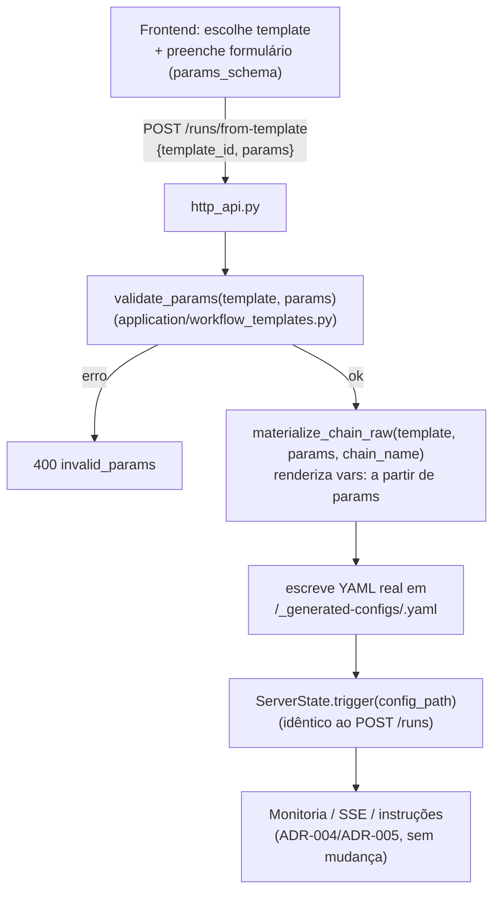

<!-- Front matter de relação: metadado que alimenta o grafo de dependências mantido
pela skill `blueprintfy` (scripts/graph_query.py). Use os nomes exatos das entradas do
CONTEXT-MAP.md em `contextos`/`afeta`. `supera` vai na ADR NOVA (a antiga é marcada
como superada pela ferramenta, não à mão). Mantenha os campos mesmo com lista vazia. -->

# ADR-007: Templates de workflow, execução ad-hoc em repositório local e modo "investigar" do Claude Code Runner

- **Status**: Proposto
- **Data**: 2026-09-06
- **Autor**: Gerado a partir de demanda informal (elicitação direta em conversa)
- **PRD relacionado**: Nenhum — origem é uma demanda informal, não um documento formal.

## Contexto

O frontend (ADR-006) hoje dispara execuções de um jeito rígido: o usuário digita um
texto livre ("ID de documento de referência"), a SPA resolve isso por **convenção
exata de nome de arquivo** (`<diretório-base>/<id>.yaml`) e chama `POST /runs`. Não há
seleção de plugin/workflow na UI, nenhuma forma de escolher em qual repositório local
rodar, e nenhuma forma de descobrir specs disponíveis num repositório remoto de
documentação — o usuário precisa saber de cor o ID e confiar que o arquivo
correspondente já existe no disco do backend.

O usuário pediu explicitamente: (1) que o frontend consulte diretamente um repositório
remoto configurável (mesmo padrão já provado em `doc-repo-example` + `docs-mcp-proxy`,
ver `playbooks/docusaurus-mcp-docs-proxy.md`) e permita selecionar uma ou mais specs;
(2) uma config para declarar uma pasta de trabalho local com vários repositórios, para
listar e escolher em qual rodar; (3) que o motor receba um prompt livre mais quais
documentos consultar, investigue impacto no repositório-alvo, sem necessariamente abrir
PR; (4) que o frontend só precise dizer **quais plugins o motor deve usar** — o motor é
quem sabe compor a cadeia. `ai-lup-poc-target-cli` (repositório já usado como alvo real
do pipeline SDD da feature `002`, ver `progress.md`) passa a ser o alvo de referência
deste novo workflow.

Tudo isso é **aditivo**: nenhuma funcionalidade existente (listar runs, ver detalhe,
stream ao vivo, mandar instrução, cancelar, e o próprio pipeline completo
`implementar-historia-sdd`) é removida — só a forma de **disparar** um novo run ganha um
caminho novo, alternativo ao `POST /runs {config_path}` já existente.

**Decisões fechadas com o usuário antes desta ADR** (não reabertas aqui):
- O frontend consulta o repositório remoto de specs **direto do browser** (`fetch` em
  `<url configurável>/docs-index.json`), sem proxy no backend.
- A execução em repositório local roda **direto num checkout já existente**, sem clonar
  via `workspace_setup` — precisa de um endpoint novo que liste subpastas de um
  diretório-raiz **configurado no backend** (não no frontend/localStorage).
- A seleção de "quais plugins usar" é feita via **templates de workflow pré-definidos**:
  o backend expõe a lista de templates com seus parâmetros esperados; o frontend só
  escolhe um e preenche o formulário.
- O novo modo de execução é um **modo novo no `claude_code_runner.py` existente**
  (`investigar`), não um plugin separado — reaproveita 100% da infraestrutura de
  streaming/instruções já validada na ADR-005.
- O `configDir`/`resolveConfigPath.js` do frontend (ADR-006) ficam órfãos com este
  redesenho e são removidos — quem precisar disparar por `config_path` bruto continua
  podendo, via `POST /runs` direto (CLI/scripts), que não muda.

## Requisitos atendidos

| ID | Requisito | Tipo |
|----|-----------|------|
| RF-01 | Novo endpoint `GET /workflows`: lista templates de workflow disponíveis, cada um com `id`/`label`/`description`/`params_schema` (schema dos parâmetros que o template espera) | Funcional |
| RF-02 | Novo endpoint `GET /workspace/repos`: lista as subpastas imediatas de um diretório-raiz configurado no processo `serve` (`--local-repos-root`); sem essa flag, retorna lista vazia (não erro) | Funcional |
| RF-03 | Novo endpoint `POST /runs/from-template {template_id, params}`: valida os `params` recebidos contra o `params_schema` do template, monta e dispara uma execução real — mesma resposta (`{chain_name, status}`) de `POST /runs`, que continua existindo sem alteração | Funcional |
| RF-04 | Um template é um arquivo de chain config válido que também declara sua própria metadata (`id`/`label`/`description`/`params_schema`) — um único arquivo, sem duplicação em formato separado | Funcional |
| RF-05 | Novo modo `investigar` no Claude Code Runner: aceita `prompt` (texto livre) + `docs_referenced` (lista de ids) + `workspace_path` vindo de `context.params` (além de `context.input`, para compat com `coding`/`review`); não cria branch, não commita, não abre PR | Funcional |
| RF-06 | Template de referência `investigar-impacto` roda contra um repositório local já existente, usando um MCP config novo (`docs-mcp-proxy`, apontando para `doc-repo-example`) | Funcional |
| RF-07 | Template `implementar-historia-sdd` expõe o pipeline completo já existente (clone+coding+PR+CI+review, ADR-002) como um template selecionável — preserva 100% o comportamento atual | Funcional |
| RNF-01 | `POST /runs/from-template` reusa o mesmo caminho de disparo/monitoria/stream/instruções que `POST /runs` já usa — nenhuma mudança em `ChainLoaderPort`, `_resolve_active_claude_step` ou nos endpoints da ADR-005 | Não-funcional |
| RNF-02 (herdado) | `Plugin.run(context) -> output` / `TransientError` (ADR-001) não muda | Não-funcional |

## Decisão

- **Template = chain config + metadata, um arquivo só**: `backend/config/workflow_
  templates/<id>.yaml` é, ao mesmo tempo, um chain config válido (`name`/`vars`/`steps`,
  carregável sem modificação por `YamlJsonChainLoader.load()`) e um descritor de
  template (`id`/`label`/`description`/`params_schema`, ignorados pelo loader porque ele
  só lê as chaves que conhece). Descoberto por `FileSystemWorkflowTemplateRegistry`
  (mesma convenção de `FileSystemPluginRegistry`: um arquivo malformado é logado e
  pulado, nunca derruba os demais).
- **Materializar YAML em disco, não mudar `ChainLoaderPort`**: `_resolve_active_claude_
  step` (ADR-005) recarrega a chain do disco via `YamlJsonChainLoader().load(config_
  path)` sempre que resolve o step ativo para `/stream`/`/instrucoes`. Se a chain de um
  template só existisse em memória, esse mecanismo quebraria. `ServerState.trigger_from_
  template` renderiza um YAML real em `<watch_dir>/_generated-configs/<chain_name>.yaml`
  e então chama `self.trigger(str(config_path))` — o mesmo método que `POST /runs` já
  usa, sem nenhuma mudança nele. Um run disparado por template é indistinguível de um
  disparado por `config_path` direto para qualquer coisa downstream (monitoria, stream,
  instruções, cancelamento).
- **`chain_name` único por disparo**: `f"{template_id}--{uuid4().hex[:8]}"` — evita
  colisão entre disparos concorrentes do mesmo template (RF-03), sem exigir que o
  usuário escolha um nome.
- **`validate_params`/`materialize_chain_raw` são funções puras** (`application/
  workflow_templates.py`, sem import de infraestrutura): a primeira só verifica
  `required`; a segunda clona `template.raw`, troca o `name` pelo `chain_name` gerado e
  faz merge de `params` submetidos em `vars:` — com um detalhe importante: todo param
  declarado no `params_schema` recebe um default `""` **antes** do merge, para que um
  param opcional não submetido ainda resolva (`{{ vars.x }}` não pode referenciar uma
  chave ausente — a validação do Chain Loader roda antes de qualquer step executar).
- **Bug pontual corrigido em `YamlJsonChainLoader._resolve_vars`**: antes desta ADR, a
  substituição de `{{ vars.<chave> }}` sempre fazia `str(raw_vars[chave])`, mesmo quando
  o valor inteiro do param era exatamente essa referência — um param `docs_referenced`
  (lista, vinda do multiselect de specs do frontend) viraria a *string*
  `"['005-a', '004-b']"` em vez de um array de verdade. Corrigido: quando o valor do
  param é **exatamente** (após strip) uma referência `{{ vars.x }}` inteira, o valor
  original de `raw_vars[x]` é devolvido sem `str()`, preservando o tipo (lista, bool,
  etc.); uma referência parcial/embutida (ex.: `"Docs: {{ vars.x }} (fim)"`) continua
  virando string como antes — retrocompatível, coberto por teste de regressão.
- **`GET /workspace/repos`**: lista as subpastas imediatas de `--local-repos-root`
  (novo flag de `workflow serve`, mesmo padrão de `--watch-dir`/`--plugins-dir` — config
  do processo backend, não do navegador). Sem a flag, retorna `[]` — decisão explícita
  para não exigir essa configuração de quem só quer os templates que não precisam dela.
- **Modo `investigar` no Claude Code Runner**: mesma classe/arquivo (`plugins/claude_
  code_runner.py`), contrato externo do plugin inalterado — só um `modo` novo, ao lado
  de `coding`/`review`. Prompt monta a partir de `prompt` + hint de `docs_referenced`
  (se houver), instruindo explicitamente para não criar branch, não commitar/dar push,
  não abrir PR, e para retornar `relatorio` + `docs_consultados` estruturados (schema
  JSON próprio, mesma mecânica de `--json-schema` já usada em `coding`/`review`).
  `workspace_path` vem de `context.params` (novo — o template `investigar-impacto` não
  tem um step `workspace_setup` antes) e continua aceitando `context.input` quando
  presente, para não quebrar nada de `coding`/`review`. Reusa `_build_cmd`/`_run_
  streaming_session`/`_poll_instructions` sem nenhuma alteração — stream SSE e
  instruções ao vivo (ADR-005) continuam funcionando automaticamente para este modo.
- **MCP novo para o template `investigar-impacto`**: `backend/config/mcp-docs-proxy.
  json`, apontando para o servidor `docs-mcp-proxy` (stdio, dockerizado, raiz do
  monorepo) com `BASE_URL=https://luishpcosta.github.io/doc-repo-example` — a mesma
  fonte que o `SpecPicker` do frontend lista via fetch direto em `/docs-index.json`,
  para que os ids de spec escolhidos na UI sejam os mesmos que o agente consegue buscar
  via MCP em runtime. Diferente do `config/mcp-docusaurus.json` já existente (HTTP,
  `docusaurus-plugin-mcp-server`, usado pelos templates de `coding`/`review`) —
  deliberadamente não reaproveitado, por apontarem para fontes de documentação
  diferentes.
- **`implementar-historia-sdd` também vira um template**: mesmos `steps:` de `backend/
  examples/implementar-historia-sdd.yaml`, com `params_schema` cobrindo `repo_url`/
  `historia_id`/`branch_name`/`branch_base`/`install_cmd`(opcional)/`docker_compose_
  path`(opcional) — o exemplo em `examples/` continua existindo e funcionando como
  estava, para quem dispara por `config_path` direto.

## Alternativas consideradas

| Alternativa | Por que não foi escolhida |
|-------------|---------------------------|
| `ChainLoaderPort` ganha um método para aceitar um dict em memória, sem escrever arquivo | Quebraria `_resolve_active_claude_step` (ADR-005), que recarrega a chain do disco a partir de `workflow_runs.config_path` — teria que ganhar um caminho especial só para runs de template, duplicando lógica sem ganho real. Materializar em disco é mais simples e reusa tudo sem mudança em nenhum port. |
| Metadata do template (`label`/`description`/`params_schema`) em um arquivo separado do chain config | Duplicaria informação (o mesmo `name`/`steps` precisaria existir nos dois) e exigiria manter dois arquivos sincronizados por template. Um único arquivo, que o Chain Loader já sabe carregar ignorando as chaves extras, é mais simples. |
| Composição livre de plugins na UI (usuário monta a sequência de steps a cada execução) | Rejeitada explicitamente pelo usuário em favor de templates pré-definidos — menos flexível, mas testável de antemão e sem exigir um "chain builder" na UI. |
| Backend proxeia a consulta ao repositório remoto de specs | Rejeitada explicitamente pelo usuário — o frontend busca `docs-index.json` direto do browser; o backend só precisa saber, via MCP já configurado na máquina, buscar o *conteúdo* dos ids que o usuário selecionou. |
| Reaproveitar `config/mcp-docusaurus.json` (HTTP) para o template `investigar-impacto` | Aponta para uma fonte de documentação diferente (`docusaurus-plugin-mcp-server` local, não `docs-mcp-proxy`/`doc-repo-example`) — usar o MCP errado faria os ids de spec escolhidos na UI não existirem do lado do agente. |

## Consequências

- **Positivas**: nenhuma mudança de contrato REST existente (`POST /runs`, `GET /runs*`,
  `/stream`, `/instrucoes`, `/cancelar` — todas ADR-004/005 — continuam idênticas);
  `implementar-historia-sdd` ganha uma segunda forma de disparo sem duplicar código;
  novos templates futuros só exigem um arquivo YAML novo em `config/workflow_templates/`,
  sem tocar em `http_api.py`.
- **Negativas / trade-offs**: `<watch_dir>/_generated-configs/` cresce indefinidamente
  nesta versão — sem limpeza automática, mesma postura já aceita para `--watch-dir` na
  ADR-004; um param opcional não submetido vira `""` em `vars:` (não `null`/ausente),
  o que é seguro para todo plugin existente (`params.get(x)` trata `""` como falsy,
  igual a ausente) mas é uma convenção que um plugin novo precisa conhecer.
- **Riscos**: o `.mcp.json` do `ai-lup-poc-target-cli` (hoje untracked nesse repo) só
  funciona se for commitado lá — sem isso, um clone novo do repositório-alvo não tem o
  MCP configurado; isso é uma tarefa fora deste monorepo, registrada em `progress.md`.

## Componentes afetados

- Domínio (`domain/models.py`, `domain/ports.py`, `domain/exceptions.py`) — novos tipos
  `WorkflowTemplateParam`/`WorkflowTemplateDefinition`, port
  `WorkflowTemplateRegistryPort`, exceção `WorkflowTemplateNotFoundError`.
- Novo adapter `adapters/filesystem_workflow_template_registry.py`.
- Nova aplicação `application/workflow_templates.py` (`validate_params`,
  `materialize_chain_raw`).
- `adapters/yaml_json_chain_loader.py` — fix pontual em `_resolve_vars` (preserva tipo).
- API HTTP (`adapters/http_api.py`, ADR-004/005) — três rotas novas, `ServerState`
  ganha `template_registry`/`local_repos_root`/`generated_configs_dir`.
- CLI (`adapters/cli.py`) — dois flags novos em `serve`.
- Plugin Claude Code Runner (`plugins/claude_code_runner.py`, ADR-002/005) — modo
  `investigar` novo, contrato externo inalterado.
- Novos arquivos de config: `config/mcp-docs-proxy.json`,
  `config/workflow_templates/investigar-impacto.yaml`,
  `config/workflow_templates/implementar-historia-sdd.yaml`.
- **Frontend** (`afeta: [frontend]`) — consome `GET /workflows`/`GET /workspace/repos`/
  `POST /runs/from-template`; ADR/spec própria do contexto `frontend` cobre o lado dele
  (ver `frontend/docs/specs/007-selecao-template-execucao/`).

> Atividades e Acceptance Criteria detalhadas estão em `ADR-007-acs.md`.
