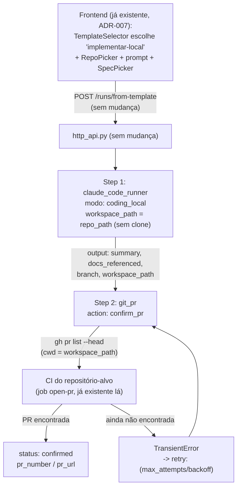

<!-- Front matter de relação: metadado que alimenta o grafo de dependências mantido
pela skill `blueprintfy` (scripts/graph_query.py). Use os nomes exatos das entradas do
CONTEXT-MAP.md em `contextos`/`afeta`. `supera` vai na ADR NOVA (a antiga é marcada
como superada pela ferramenta, não à mão). Mantenha os campos mesmo com lista vazia. -->

---
id: ADR-008
titulo: Modo "coding_local" e template implementar-local — implementação em repositório local, PR aberta pela CI do próprio repositório-alvo
status: proposto            # proposto | aceito | superado
contextos: [motor-workflow]
afeta: []
supera: []
depende_de: [ADR-002, ADR-005, ADR-007]
---

# ADR-008: Modo "coding_local" e template implementar-local — implementação em repositório local, PR aberta pela CI do próprio repositório-alvo

- **Status**: Proposto
- **Data**: 2026-09-06
- **Autor**: Gerado a partir de demanda informal (elicitação direta em conversa, skill `issue-to-adr`)
- **PRD relacionado**: Nenhum — origem é uma demanda informal, não um documento formal.

## Contexto

A ADR-007 deu ao painel um mecanismo genérico de disparo por template (`TemplateSelector`
+ `DynamicParamsForm`, que delega para `RepoPicker`/`SpecPicker` conforme o `source`
declarado no `params_schema`), mas só ligou esse mecanismo ao template `investigar-impacto`
— leitura, sem branch/commit/PR. O único template que de fato **implementa** código
(`implementar-historia-sdd`, herdado da ADR-002) continua exigindo `repo_url` (texto livre,
clonado do zero por `workspace_setup`) em vez de um repositório local já existente
selecionável via `RepoPicker`, e abre a PR ele mesmo via `git_pr`/`gh pr create`.

O usuário quer implementar contra um repositório local **já instrumentado com seu próprio
harness SDD e seu próprio fluxo de Git** — verificado ao vivo em `ai-lup-poc-target-cli`
(`CLAUDE.md`, seção "Git Workflow", e `.github/workflows/ci.yml`): esse repositório nunca
recebe push direto em `main`; o próprio agente cria/troca para uma branch `feature/<slug>`
e dá push; a CI do repositório-alvo (job `open-pr`, condicionado a
`startsWith(github.ref_name, 'feature/')`) roda `init.sh` e, se passar, abre a PR sozinha
via `gh pr create` — a própria instrumentação diz explicitamente "Do not open the PR
yourself". Usar o `git_pr` do motor para **criar** a PR aqui seria redundante com essa
instrumentação (na melhor hipótese) ou brigar com ela (na pior, se as convenções de
título/body divergirem).

**Decisões fechadas com o usuário antes desta ADR** (não reabertas aqui):
- Uma única opção de fluxo, não variantes: nada de "implementa sem PR" nem de "PR aberta
  pelo motor com checks/review completos" (isso já existe, é o `implementar-historia-sdd`
  antigo, intocado). Aqui é implementação local + confirmação de que a PR abriu pela via
  do próprio repositório-alvo.
- Confirmação de que a PR abriu é feita por **polling com timeout** (não uma checagem
  única, não apenas confiar no relato do agente).

**Assunção registrada** (não validada com o usuário, sinalizada para revisão): o tempo de
polling (quantas tentativas, com que backoff) assume que a CI do repositório-alvo é rápida
(roda só `init.sh`, como em `ai-lup-poc-target-cli`) — os valores propostos na Decisão
abaixo (`max_attempts: 5, initial_delay: 30s, multiplier: 1.5`, ~6-7 min de espera total)
são um ponto de partida ajustável por repositório-alvo, não um número validado com CI real
mais lenta.

## Requisitos atendidos

| ID | Requisito | Tipo |
|----|-----------|------|
| RF-01 | Novo template `implementar-local`: `params_schema` com `repo_path` (`source: local_repos`), `prompt` (texto livre) e `docs_referenced` (`source: spec_multiselect`, opcional) — mesmo shape de `investigar-impacto`, mas `modo: coding_local` | Funcional |
| RF-02 | Novo modo `coding_local` no Claude Code Runner: roda contra um `workspace_path` já existente (sem `workspace_setup` antes — sem clone, sem branch criada pelo motor); instrui o agente a ler e seguir o fluxo de Git **documentado no próprio repositório-alvo** (branch, commit, push) e a **não abrir a PR ele mesmo**; retorna `branch` (nome da branch que o agente deu push) além de `summary`/`docs_referenced` | Funcional |
| RF-03 | Nova ação `confirm_pr` no plugin `git_pr`: dado `branch` (carry-forward do step anterior), roda `gh pr list --head <branch>` no `workspace_path`; se não achar PR, levanta `TransientError` (retriable pela política `retry:` do step); se achar, retorna `pr_number`/`pr_url`/`status: confirmed` | Funcional |
| RF-04 | Nenhuma ação `create_pr`/`update_pr` é chamada neste fluxo — quem abre a PR é exclusivamente a CI do repositório-alvo | Funcional |
| RNF-01 | Nenhuma mudança em `POST /workflows`, `POST /workspace/repos`, `POST /runs/from-template`, nem no frontend — o mecanismo genérico da ADR-007 (`TemplateSelector`/`DynamicParamsForm`/`RepoPicker`/`SpecPicker`) já cobre este template sem alteração de código | Não-funcional |
| RNF-02 (herdado) | `Plugin.run(context) -> output` / `TransientError` (ADR-001) não muda | Não-funcional |
| RNF-03 (herdado) | `git_pr`, `claude_code_runner`: contrato externo dos modos/ações existentes (`coding`, `review`, `investigar`, `create_pr`, `update_pr`) permanece inalterado — mudança é 100% aditiva | Não-funcional |

## Decisão

- **`coding_local` é um modo novo no `claude_code_runner.py` existente**, ao lado de
  `coding`/`review`/`investigar` — mesma classe/arquivo, contrato externo do plugin
  inalterado (reaproveita `_build_cmd`/`_run_streaming_session`/`_poll_instructions`,
  logo stream SSE e instruções ao vivo da ADR-005 funcionam automaticamente). Como
  `investigar` (ADR-007), lê `workspace_path` de `context.params` (não há
  `workspace_setup` antes na cadeia) — mas ao contrário de `investigar`, **modifica** o
  repositório (commit/push), então precisa de um schema/prompt próprios:
  - Schema (`_CODING_LOCAL_SCHEMA`): `summary` (string), `docs_referenced` (array),
    **`branch`** (string, novo campo obrigatório) — o motor não sabe de antemão qual
    branch o agente vai criar (quem decide o nome, seguindo a convenção do
    repositório-alvo, é o próprio agente), então precisa que o agente reporte.
  - Prompt: instrui a implementar o `prompt` recebido, **ler e seguir o fluxo de Git
    documentado no próprio repositório** (ex.: `CLAUDE.md`) — nunca push direto em
    `main`, criar/trocar branch, commitar, dar push — e **não abrir a PR** (a CI do
    repositório-alvo faz isso). Retorna `branch` com o nome exato da branch que recebeu
    o push.
  - O `output` inclui `workspace_path` explicitamente (diferente de `investigar`, que
    não precisa — aqui o step seguinte, `confirm_pr`, precisa do `cwd` via
    carry-forward) e `branch`, além de `summary`/`docs_referenced`/`session_log_path`.
- **`confirm_pr` é uma ação nova no `git_pr.py` existente**, ao lado de
  `create_pr`/`update_pr` — não um plugin novo, não um script `.sh` novo. Motivo:
  evita o problema de resolução de caminho que um script teria (um `.sh` do motor
  precisaria ser resolvido contra o cwd do processo `serve`, não contra
  `workspace_path`, ao contrário do padrão hoje usado por `shell_script_runner`/
  `poll_ci_checks.sh`, que assume o script vendorizado **dentro** do repositório-alvo
  clonado — não é o caso aqui, o repositório é local e não necessariamente vendoriza
  nada do motor) — e reaproveita a infraestrutura de `gh` CLI + `TransientError` que o
  plugin já tem. `run()` passa a checar `action == "confirm_pr"` **antes** de exigir
  `title_template`/`body_template` (que essa ação não usa) e retorna cedo.
  `_confirm_pr`: roda `gh pr list --head <branch> --json number,url --jq ".[0]"` com
  `cwd = workspace_path`; saída vazia -> `TransientError` (ainda não abriu, deixa o
  `retry:` do step tentar de novo); saída com JSON -> `{pr_number, pr_url, status:
  "confirmed"}`.
- **Retry como mecanismo de polling com timeout** (decisão do usuário): o step
  `confirmar_pr` do template usa a política `retry:` já existente no motor (mesmo
  mecanismo de `aguardar_checks` em `implementar-historia-sdd`) — `max_attempts: 5`,
  `initial_delay: 30.0`, `multiplier: 1.5` (~6-7 min de espera total, tentativas a
  cada 30s/45s/67s/101s/151s) como ponto de partida ajustável (ver Assunção, acima).
  Estourar `max_attempts` sem achar PR é falha da run — não silenciosa, aparece no
  painel como qualquer outra falha de step.
- **Template `implementar-local.yaml`**: dois steps só (`implementar` +
  `confirmar_pr`), sem `workspace_setup` — `params_schema` idêntico em forma ao de
  `investigar-impacto` (`repo_path`/`source: local_repos`, `prompt`, `docs_referenced`/
  `source: spec_multiselect`), reaproveita o mesmo `mcp_config_path` de
  `config/mcp-docs-proxy.json` (mesma fonte de specs que o `SpecPicker` do frontend
  lista) — nenhuma mudança de MCP nova.
- **Nenhuma mudança no frontend**: o mecanismo genérico da ADR-007
  (`TemplateSelector` lê `GET /workflows`; `DynamicParamsForm` renderiza por
  `source`) já é suficiente — o novo template aparece na lista automaticamente assim
  que o arquivo YAML existir no backend.

## Alternativas consideradas

| Alternativa | Por que não foi escolhida |
|-------------|---------------------------|
| Reaproveitar `workspace_setup` + `action: create_pr` do `git_pr`, adaptando pra não clonar | `workspace_setup` sempre cria uma branch nova a partir de `branch_base`/`branch_name` fornecidos como parâmetro — não é "seguir a convenção do próprio repositório-alvo", é o motor decidindo o nome/fluxo da branch. E `create_pr` chamaria `gh pr create` diretamente, duplicando (ou colidindo com) o job `open-pr` que já existe na CI do repositório-alvo. |
| Confirmação de PR via script `.sh` novo (`shell_script_runner`), no padrão de `poll_ci_checks.sh` | `shell_script_runner` roda `script_path` com `cwd = workspace_path`; um caminho relativo resolve **dentro do repositório-alvo**, não dentro do motor — funciona hoje só porque `poll_ci_checks.sh` é vendorizado no repositório clonado. Um script do motor precisaria de resolução de caminho absoluta (como o fix de `mcp_config_path` na ADR-007), o que effectively significaria mudar `shell_script_runner` para todo mundo — risco de regressão em `aguardar_checks`, que depende do comportamento atual. Uma ação nova em `git_pr` evita o problema inteiro. |
| Confirmação só pelo relato do agente (JSON `pr_aberta: bool`) | Rejeitada explicitamente pelo usuário — o agente reportar "abri" não é verificação; a CI é quem efetivamente abre, e pode falhar depois do push (ex.: `init.sh` falha na CI mesmo tendo passado localmente). |
| `historia_id` continua sendo um param obrigatório (como em `implementar-historia-sdd`) | O repositório-alvo já tem sua própria convenção de rastreabilidade (`specs/NNN-slug`, mencionada em `CLAUDE.md`) — obrigar um `historia_id` redundante no motor não agrega e a validação de rastreabilidade do `git_pr` (`_validate_traceability`) sequer roda nesta ação (`confirm_pr` não valida body de PR, só existência). |

## Consequências

- **Positivas**: reaproveita 100% do mecanismo de disparo por template/repo-local/spec
  da ADR-007 sem tocar em frontend, HTTP API ou domínio; `git_pr` ganha uma ação
  read-only (baixo risco) ao lado das que já escrevem; `claude_code_runner` ganha um
  modo novo isolado (mesmo padrão de `investigar`), sem tocar em `coding`/`review`.
- **Negativas / trade-offs**: o nome da branch fica sob responsabilidade do agente
  (relatado via JSON), não determinístico como em `workspace_setup` — se o agente
  reportar um nome errado (não é o que foi de fato dado push), `confirm_pr` vai
  procurar a branch errada e estourar `max_attempts` sem achar PR nenhuma, mesmo que
  a PR real tenha aberto. Nenhuma validação cruzada (`git branch --show-current`) foi
  incluída nesta versão.
- **Riscos**: os valores de `retry:` (`max_attempts`/`initial_delay`/`multiplier`) são
  uma assunção não validada contra a CI real do repositório-alvo (ver Contexto) — uma
  CI mais lenta que ~6-7 min faria a run falhar por timeout mesmo com a PR abrindo
  depois. Ajustável por template sem mudança de código.

## Componentes afetados

- Plugin Claude Code Runner (`backend/plugins/claude_code_runner.py`) — modo
  `coding_local` novo (dispatch em `run()`, `_run_coding_local`, `_coding_local_prompt`,
  `_CODING_LOCAL_SCHEMA`), contrato externo dos modos existentes inalterado.
- Plugin Git/PR (`backend/plugins/git_pr.py`) — ação `confirm_pr` nova (`run()` passa a
  checar a ação antes de exigir `title_template`/`body_template`; `_confirm_pr` novo),
  contrato externo de `create_pr`/`update_pr` inalterado.
- Novo arquivo de template: `backend/config/workflow_templates/implementar-local.yaml`.
- Nenhuma mudança em domínio, aplicação, HTTP API, CLI ou frontend.

> Atividades e Acceptance Criteria detalhadas estão em `ADR-008-acs.md`.
