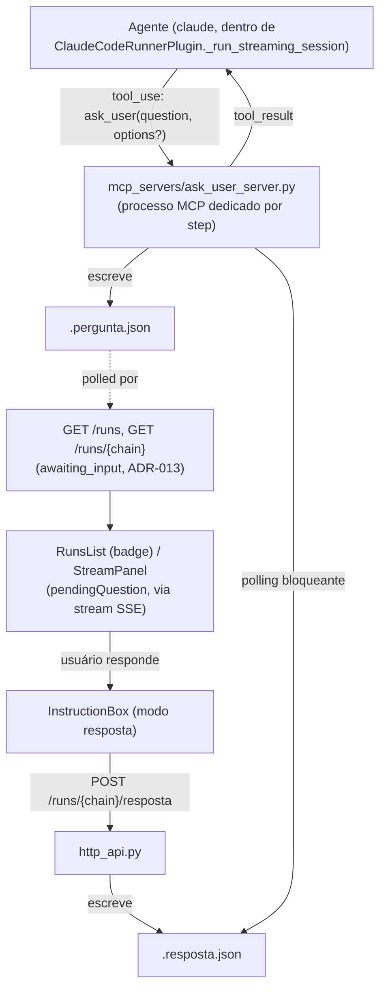

<!-- Front matter de relação: metadado que alimenta o grafo de dependências mantido
pela skill `blueprintfy` (scripts/graph_query.py). Use os nomes exatos das entradas do
CONTEXT-MAP.md em `contextos`/`afeta`. `supera` vai na ADR NOVA (a antiga é marcada
como superada pela ferramenta, não à mão). Mantenha os campos mesmo com lista vazia. -->

---
id: ADR-013
titulo: Pausa real do agente para pergunta ao usuário (tool MCP ask_user, modo coding_local_interativo) — workflow interativo mantendo o atual intacto
status: proposto            # proposto | aceito | superado
contextos: [motor-workflow, frontend]
afeta: [frontend]
supera: []                  # [<ADR-id>] se substitui uma decisão anterior
depende_de: [ADR-002, ADR-005, ADR-006, ADR-008, ADR-010, ADR-011]
---

# ADR-013: Pausa real do agente para pergunta ao usuário (tool MCP ask_user, modo coding_local_interativo) — workflow interativo mantendo o atual intacto

- **Status**: Proposto
- **Data**: 2026-09-09
- **Autor**: Gerado a partir de demanda informal (elicitação direta em conversa)
- **PRD relacionado**: Nenhum — origem é uma demanda informal, não um documento formal.

## Contexto

O usuário pediu um workflow "semelhante ao atual", mas onde a etapa de coding seja
**interativa de verdade**: não só streaming (ver o agente trabalhando), mas poder
**responder a um questionamento do agente em tempo real**, sem alterar o workflow
existente — a opção atual precisa continuar existindo, intocada.

Duas descobertas da investigação prévia a esta ADR moldam a decisão:

- **Não existe hoje nenhum mecanismo de pausa real.** O candidato mais próximo,
  `confirm_pr` (ADR-008), não é human-in-the-loop — é polling com `TransientError`/
  `retry:`, que nunca devolve controle a um humano; `Plugin.run(context) -> output`
  (ADR-001) é síncrono, sem noção de pausa no contrato do motor. O mecanismo mais
  próximo de "mandar algo para uma execução em andamento" é o par
  `GET /runs/{chain_name}/stream` + `POST /runs/{chain_name}/instrucoes` (ADR-005):
  funciona, mas é *fire-and-forget* e descorrelacionado — nada garante que o agente
  realmente pare e espere antes de seguir em frente.
- **Só uma tool call MCP garante bloqueio de verdade.** `claude` em `--print` não
  pausa sozinho por convenção de prompt: `--json-schema` força uma saída final a
  cada turno, então "perguntar e seguir em frente com um palpite" é o comportamento
  padrão sem uma tool call pendente. Uma tool call é a única coisa que o laço
  agêntico do próprio CLI genuinamente bloqueia em cima — o agente não avança de um
  `tool_use` sem receber o `tool_result` correspondente. Por isso a decisão é uma
  tool MCP dedicada (`ask_user`), não uma extensão do canal de instruções da
  ADR-005.

**Decisões fechadas com o usuário antes desta ADR** (não reabertas aqui):
- Base é o template `claude-implementar-local` (ADR-008: repositório local,
  `confirm_pr` verifica a PR aberta pela CI do repositório-alvo) — não
  `implementar-historia-sdd`.
- Mecanismo é uma tool MCP dedicada (`ask_user`), não uma evolução do canal de
  `instrucoes` existente.
- A resposta no painel é dada **evoluindo o `InstructionBox` já existente** (troca
  de modo quando há pergunta pendente), não um componente novo — com suporte a
  pergunta de múltipla escolha quando o agente oferece opções.
- A listagem principal (`RunsList`) precisa sinalizar, sem precisar abrir o
  detalhe de cada run, quando o agente de uma execução está esperando resposta —
  levantado depois da primeira implementação, coberto nesta mesma ADR (RF-05/
  RF-07 abaixo) em vez de virar uma ADR à parte, pelo mesmo raciocínio de "contrato
  pequeno, mesmo mecanismo" já usado em ADR-011/ADR-012 para extensões de
  `GET /runs`.

## Requisitos atendidos

| ID | Requisito | Tipo |
|----|-----------|------|
| RF-01 | Novo servidor MCP local `mcp_servers/ask_user_server.py` (stdio, `FastMCP`), tool `ask_user(question, options?)`: publica a pergunta num arquivo determinístico, bloqueia até uma resposta aparecer (ou até um timeout), devolve o texto como resultado da tool | Funcional |
| RF-02 | Novo modo `coding_local_interativo` no Claude Code Runner — idêntico a `coding_local` (ADR-008), mais um `--mcp-config` mesclado por execução dando ao agente a tool `ask_user` | Funcional |
| RF-03 | Novo endpoint `POST /runs/{chain_name}/resposta`: escreve a resposta no arquivo que `ask_user_server.py` está esperando — canal separado de `POST /runs/{chain_name}/instrucoes` (ADR-005), que continua existindo e inalterado | Funcional |
| RF-04 | Novo template `claude-implementar-local-interativo`, mesma cadeia de `claude-implementar-local` (ADR-008) trocando só o `modo` do step `implementar` | Funcional |
| RF-05 | Campo aditivo `awaiting_input` em `GET /runs` e `GET /runs/{chain_name}` — `true` só enquanto a run está `running` **e** existe uma pergunta `ask_user` pendente (mesma convenção de arquivo, sem coluna nova no State Store) | Funcional |
| RF-06 | `InstructionBox` (frontend) evolui: sem pergunta pendente, comportamento idêntico ao de hoje; com pergunta pendente (repassada por `StreamPanel`/`RunDetail`), vira formulário de resposta — texto livre ou um botão por opção, quando o agente oferece escolhas | Funcional |
| RF-07 | `RunsList` (frontend) destaca, na listagem principal, uma run com `awaiting_input: true` — mesmo padrão passivo já usado para runs `failed` (ADR-006-AC-12) | Funcional |
| RNF-01 | `claude-implementar-local.yaml` e os modos `coding`/`review`/`investigar`/`coding_local` existentes permanecem inalterados — mudança 100% aditiva | Não-funcional |
| RNF-02 (herdado) | `Plugin.run(context) -> output` / `TransientError` (ADR-001) não muda | Não-funcional |
| RNF-03 (herdado) | Mecanismo funciona igual para execuções disparadas por `serve`, `run` ou `run-many` — baseado em arquivo, mesma convenção de `session_log_path`/`instructions_path` (ADR-005, RNF-01) | Não-funcional |

## Decisão

- **`ask_user` é uma tool MCP, não uma extensão de `instructions_path`**: rodada
  como um processo `stdio` próprio, declarado num `--mcp-config` **mesclado por
  execução** (`ClaudeCodeRunnerPlugin._build_interactive_mcp_config`) — junta o MCP
  estático já configurado no template (ex.: `docs-mcp-proxy`) com uma entrada
  `ask-user` cujo `command` é `sys.executable` (garante o mesmo interpretador com o
  pacote `mcp` instalado) e cujo `env` carrega `WORKSPACE_PATH`/`RUN_ID`/
  `STEP_NAME` — os três dados que o servidor precisa para calcular os mesmos
  caminhos determinísticos que o resto do motor já usa. O arquivo mesclado é
  escrito em `<step>.mcp-config.json`, ao lado de `session_log_path`/
  `instructions_path`, e é o que vai para `--mcp-config` no lugar do estático.
- **Caminhos determinísticos, mesma convenção da ADR-002/ADR-005** (par por
  step, não por pergunta — no máximo uma pergunta pendente por vez, porque a
  própria tool call bloqueia o agente):
  - `pergunta_path` = `<workspace_path>/.workflow-logs/<run_id>/<step_name>.pergunta.json`
  - `resposta_path` = `<workspace_path>/.workflow-logs/<run_id>/<step_name>.resposta.json`
- **`ask_user_server.py` bloqueia com polling de arquivo + timeout** (mesma
  técnica de `_poll_instructions`, ADR-005, aplicada ao sentido contrário): escreve
  `pergunta_path`, faz polling de `resposta_path` a cada ~0.5s até aparecer ou até
  `ASK_USER_TIMEOUT_SECONDS` (default 1200s/20min — mesma postura de "assunção
  ajustável, não validada" já usada no backoff de `confirm_pr`, ADR-008); no
  timeout, devolve um texto de fallback instruindo o agente a prosseguir com seu
  melhor julgamento, em vez de travar a run indefinidamente.
- **`POST /runs/{chain_name}/resposta` é deliberadamente separado de
  `/instrucoes`**: mesma resolução (`_resolve_active_claude_step`, ADR-005), mas
  escreve `resposta_path` (sobrescreve, não acrescenta — no máximo uma pergunta
  pendente) em vez de `instructions_path`. `/instrucoes` empurra uma mensagem nova
  no meio de um turno em andamento (viés de "interromper", sem garantia de
  pausa); `/resposta` destrava especificamente uma tool call que já está
  bloqueando o agente (viés de "responder", com garantia de pausa vinda do
  protocolo de tool-use, não de convenção).
- **`awaiting_input` é aditivo, derivado em tempo de leitura, sem migração**: mesma
  filosofia de `plugin` (ADR-010) e `archived`/`duration_seconds` (ADR-011/012) —
  `status == "running" and <pergunta_path existe>`, reaproveitando
  `_resolve_active_claude_step` já usado por `/stream`/`/instrucoes`. Sem
  coluna nova no State Store (o `CHECK` de `step_executions.status` continua só
  `pending|running|completed|failed`) — o custo extra de I/O (reload da YAML da
  chain) só acontece para chains que já estão `running`, nunca para uma listagem
  cheia de runs terminadas.
- **`coding_local_interativo` é um modo novo, ao lado de `coding_local`**: mesmo
  arquivo/classe (`plugins/claude_code_runner.py`), reaproveita
  `_run_streaming_session`/`_poll_instructions` sem alteração — o `ask_user` roda
  inteiramente dentro do processo MCP, invisível ao laço de leitura de
  `proc.stdout` do plugin, que continua tratando a chamada como qualquer outra
  tool call. `coding_local` não é tocado.
- **`InstructionBox` evolui em vez de nascer um componente novo**: `StreamPanel`
  já parseia `tool_use`/`tool_result` genericamente (`claudeStream.js`, ADR-010)
  — uma chamada `ask_user` ainda `running` (sem `tool_result`) já aparece como um
  turno `tool` comum; `StreamPanel` só precisou extrair esse turno como
  `pendingQuestion` e repassar via um prop novo (`onPendingQuestion`, mesmo padrão
  de `onRefresh`) para `RunDetail`, que por sua vez passa para `InstructionBox`.
  Sem pergunta pendente, `InstructionBox` continua exatamente como estava.

## Alternativas consideradas

| Alternativa | Por que não foi escolhida |
|-------------|---------------------------|
| Estender `instructions_path`/`POST /instrucoes` (ADR-005) para servir de canal de pergunta/resposta | Não garante pausa: a CLI em `--print` não bloqueia sozinha esperando uma instrução — o agente pode "perguntar" via texto simples e já seguir em frente com um palpite antes da resposta chegar, especialmente porque `--json-schema` força uma saída final a cada turno. Rejeitada explicitamente pelo usuário depois de discutida — ver decisões fechadas, acima. |
| WebSocket bidirecional dedicado para pergunta/resposta | Mesma razão já registrada na ADR-005 para o par stream/instruções: dois canais unidirecionais simples (SSE + `POST`) cobrem o caso sem introduzir um protocolo novo; aqui o "canal bidirecional" de fato necessário já existe — é o próprio protocolo de tool-use MCP entre `claude` e `ask_user_server.py`, o HTTP só precisa levar a resposta humana até esse processo. |
| Novo status `waiting_input` em `step_executions` (coluna/CHECK constraint nova no State Store) | Exigiria migração do `CHECK` constraint e tocar em todo lugar que já lê/decide com base em `status` (`get_run_detail`, `_tail_session_log`, `RunDetail`/`RunsList` no frontend) — risco de regressão amplo para um sinal que já é derivável de um arquivo, sem estado novo, no mesmo espírito de `plugin`/`archived`/`duration_seconds` (ADR-010/011/012). |
| Correlacionar pergunta/resposta por id (múltiplas perguntas pendentes simultâneas) | Desnecessário: a própria tool call bloqueia o agente, então nunca existe mais de uma pergunta pendente por step ao mesmo tempo — um par de arquivos por step (sem id) já é suficiente, mesma simplicidade de `instructions_path`. |
| Componente novo de UI para responder, ao lado de `InstructionBox` | Rejeitado explicitamente pelo usuário — evoluir `InstructionBox` reaproveita a estrutura/estilo/testes já existentes e evita dois formulários concorrentes ("instrução" vs "resposta") competindo por atenção na mesma tela. |

## Consequências

- **Positivas**: pausa real, garantida pelo protocolo de tool-use — não depende de
  o modelo "decidir" esperar; workflow atual (`claude-implementar-local`, modos
  `coding`/`review`/`investigar`/`coding_local`) inalterado, mudança 100%
  aditiva; `awaiting_input` reaproveita 100% o mecanismo file-based já provado
  pela ADR-005, sem migração de schema; frontend reaproveita `StreamPanel`/
  `InstructionBox`/`RunsList` existentes, sem componente novo.
- **Negativas / trade-offs**: nova dependência de runtime (`mcp`, pacote Python);
  um processo MCP adicional por execução do modo `coding_local_interativo`
  (custo de subprocesso, não de outro tipo); um worker do `ThreadPoolExecutor`
  (`max_parallel`) fica ocupado durante toda a espera por resposta — mesma classe
  de risco já disclosed na ADR-008 para o backoff de `confirm_pr` (~6-7 min),
  aqui potencialmente maior (até o timeout de 20 min); `awaiting_input` custa um
  reload de YAML por chain `running` a cada `GET /runs` — aceitável para o volume
  de execuções concorrentes deste motor (uso local/individual), mas é I/O extra
  por requisição, mesmo trade-off já aceito para `/stream`/`/instrucoes`.
- **Riscos**: o timeout de 20 minutos (`ASK_USER_TIMEOUT_SECONDS`, default) é uma
  assunção não validada com uso real, mesmo espírito do backoff de `confirm_pr`
  (ADR-008) — ajustável por env var, sem mudança de código; se o agente reportar
  uma pergunta mal-formada (sem `question`) ou dispensar `options` de forma
  inconsistente, o frontend degrada para o card de tool genérico (mesma rede de
  segurança de "linha não reconhecida vira raw", ADR-010) em vez de quebrar a
  tela, mas a UX de resposta fica menos guiada nesse caso.

## Componentes afetados

- Novo `backend/mcp_servers/ask_user_server.py` — servidor MCP stdio, tool
  `ask_user`.
- Plugin Claude Code Runner (`backend/plugins/claude_code_runner.py`) — modo
  `coding_local_interativo` novo (`_run_coding_local_interativo`,
  `_coding_local_interativo_prompt`, `_build_interactive_mcp_config`); modos
  existentes inalterados.
- API HTTP (`backend/src/workflow_engine/adapters/http_api.py`) — rota nova
  `POST /runs/{chain_name}/resposta`; campo aditivo `awaiting_input` em
  `list_runs`/`get_run_detail` (`GET /runs`, `GET /runs/{chain_name}`).
- Novo arquivo de template:
  `backend/config/workflow_templates/claude-implementar-local-interativo.yaml`.
- `backend/pyproject.toml` — dependência nova `mcp`.
- **Frontend** (`afeta: [frontend]`):
  - `src/lib/apiClient.js` — `postAnswer` (`POST .../resposta`), canal separado
    de `postInstruction`.
  - `src/components/StreamPanel.jsx` — deriva `pendingQuestion` de um turno
    `tool` `ask_user` ainda `running`; repassa via `onPendingQuestion`.
  - `src/components/RunDetail.jsx` — fiação de `pendingQuestion` entre
    `StreamPanel` e `InstructionBox`.
  - `src/components/InstructionBox.jsx` — evolui para formulário de resposta
    quando há pergunta pendente (texto livre ou botões de opção); comportamento
    de hoje preservado sem pergunta pendente.
  - `src/components/RunsList.jsx` — destaque passivo (`run-row-awaiting` +
    badge) para uma run com `awaiting_input: true`, mesmo padrão de
    `run-row-failed`.

> Atividades e Acceptance Criteria detalhadas estão em `ADR-013-acs.md`.
