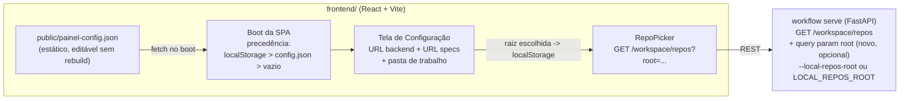

<!-- Front matter de relação: metadado que alimenta o grafo de dependências mantido
pela skill `blueprintfy` (scripts/graph_query.py). Use os nomes exatos das entradas do
CONTEXT-MAP.md em `contextos`/`afeta`. `supera` vai na ADR NOVA (a antiga é marcada
como superada pela ferramenta, não à mão). Mantenha os campos mesmo com lista vazia. -->

# ADR-009: Configuração de boot em runtime e seleção da pasta de trabalho

- **Status**: Proposto
- **Data**: 2026-09-06
- **Autor**: Gerado a partir de demanda informal (elicitação via skill issue-to-adr)
- **PRD relacionado**: Nenhum — origem é uma demanda informal descrita em conversa, não um documento formal.

## Contexto

A ADR-006 estabeleceu que a URL base do backend e a URL de specs são digitadas pelo
usuário e persistidas em `localStorage`, e a ADR-007 acrescentou `GET /workspace/repos`
para listar os repositórios locais a partir de `--local-repos-root`, uma flag do
processo `serve`. Na prática isso produziu três atritos que o usuário relatou ao usar
o painel:

1. Toda instalação nova cai na tela de configuração e exige digitar duas URLs à mão,
   mesmo quando o ambiente local é sempre o mesmo (`localhost:8000`).
2. Os campos dessa tela usam **placeholders com valores reais** (`http://localhost:8000`,
   uma URL de specs existente), o que faz o formulário parecer preenchido quando está
   vazio — o usuário lê o placeholder como valor.
3. `--local-repos-root` só existe como flag de linha de comando. Subir o backend sem
   ela — o caminho comum — deixa o seletor de repositórios permanentemente vazio
   ("Nenhum repositório local configurado no backend"), sem nenhuma forma de corrigir
   isso sem derrubar e resubir o processo com a flag certa.

O ponto 3 tem uma consequência de desenho que só ficou visível ao ler o código:
`local_repos_root` é lido **exclusivamente** por `GET /workspace/repos`
(`http_api.py`). Não é estado do motor — o disparo real usa o `repo_path` completo que
chega como parâmetro do template (ADR-007/ADR-008). A "pasta de trabalho" é, portanto,
um filtro de navegação de diretório, não configuração de execução. Isso é o que permite
resolvê-la por parâmetro de consulta em vez de estado mutável no servidor.

**Assunções registradas (elicitação, 2 rodadas):**
- Uso local/individual, sem autenticação — mesma postura de ADR-006 (RNF-01).
- Volume baixo: um usuário, um navegador, poucos repositórios sob a raiz.
- O arquivo de configuração de boot é editado por quem opera a máquina (o próprio
  usuário), não distribuído por pipeline de deploy.

## Requisitos atendidos

| ID | Requisito | Tipo |
|----|-----------|------|
| RF-01 | O painel sobe com configuração default vinda de um arquivo editável sem rebuild; com os campos obrigatórios preenchidos, entra direto no painel sem passar pela tela de configuração | Funcional |
| RF-02 | O backend resolve a raiz de repositórios também por variável de ambiente (`LOCAL_REPOS_ROOT`), mantendo a flag `--local-repos-root` com precedência | Funcional |
| RF-03 | A tela de configuração permite escolher a pasta de trabalho (raiz de repositórios) sem reiniciar o backend; a escolha persiste no navegador | Funcional |
| RF-04 | A tela de configuração deixa de usar placeholders com aparência de valor real e passa a distinguir visualmente "valor efetivo" de "sugestão" | Funcional |
| RNF-01 | Configuração continua sendo resolvida em runtime, nunca embutida no bundle (constitution, princípio 6) | Não-funcional |
| RNF-02 | A mudança de contrato REST é aditiva e retrocompatível: chamadas existentes a `GET /workspace/repos` sem o parâmetro novo mantêm o comportamento atual | Não-funcional |

## Decisão

Três partes, das quais só a terceira toca contrato REST.

- **Defaults de boot por arquivo estático (RF-01, RNF-01)**: `frontend/public/painel-config.json`
  é servido como asset estático e lido por `fetch` no boot da SPA. Não passa pelo
  bundler, logo **não viola o princípio 6** — continua sendo configuração de runtime,
  editável sem rebuild e sem reiniciar o dev server. A precedência é
  `localStorage` (o que o usuário salvou) > `painel-config.json` (default da máquina) >
  vazio (força a tela de configuração, como hoje). Um `.env` do Vite foi
  explicitamente descartado: `import.meta.env` é substituído em tempo de build, o que
  embutiria a configuração no bundle.
- **Raiz de repositórios por variável de ambiente (RF-02)**: o default do argumento
  `--local-repos-root` em `cli.py` passa de `None` para `os.environ.get("LOCAL_REPOS_ROOT")`.
  A flag explícita continua vencendo a variável. Nenhum contrato muda — é só mais uma
  fonte para o mesmo valor, e `start-local.sh` já exporta essa variável.
- **Pasta de trabalho trocável pela tela (RF-03, RNF-02)**: `GET /workspace/repos`
  ganha o parâmetro de consulta **opcional** `root`. Ausente, o comportamento é
  exatamente o de hoje (usa a raiz configurada no processo). Presente, lista as
  subpastas imediatas daquele caminho. O frontend guarda a raiz escolhida em
  `localStorage`, junto das outras duas URLs — coerente com o princípio 6 e com a
  ADR-006, que já trata `localStorage` como a camada de persistência de configuração.

A escolha do parâmetro de consulta sobre uma rota de escrita (`PUT /workspace/root`) é
deliberada: a raiz é um filtro de leitura, não estado do motor. Como parâmetro, o
endpoint permanece idempotente, não ganha estado global mutável, duas abas com raízes
diferentes não se atropelam, e nada se perde no restart do backend — a raiz vive onde
o resto da configuração do painel já vive.

## Alternativas consideradas

| Alternativa | Por que não foi escolhida |
|-------------|---------------------------|
| `.env` do Vite (`VITE_BASE_URL`) para os defaults | `import.meta.env` é substituído em tempo de build — os valores viram parte do bundle, o que conflita frontalmente com o princípio 6 da constitution. Exigiria emenda registrada em `progress.md` para entregar o mesmo resultado que o arquivo estático entrega sem conflito. |
| Rota nova `PUT /workspace/root` gravando a raiz no processo | Transforma a raiz em estado global mutável do servidor: abas com raízes diferentes se atropelam e a escolha se perde no restart, a menos que o backend passe a gravar arquivo de configuração — responsabilidade nova que ele não tem hoje. O parâmetro de consulta entrega o mesmo resultado sem nada disso. |
| Restringir `root` a uma subárvore da raiz configurada (400 fora dela) | Descartado na elicitação: limitaria justamente trocar de árvore de trabalho, que é o requisito. A postura de segurança não muda em relação ao que já existe — ver Riscos. |
| Backend expor um navegador de diretórios (subir/descer na árvore) | Escopo bem maior que o pedido; digitar/colar o caminho da raiz resolve o caso relatado, e a listagem de subpastas já dá o passo seguinte. |
| Manter só a variável de ambiente, sem seleção pela tela | Resolve o boot mas não o caso de trocar de árvore de trabalho durante o uso, que foi pedido explicitamente. |

## Consequências

- **Positivas**: instalação nova sobe funcionando sem digitar nada, desde que o
  `painel-config.json` da máquina esteja preenchido; a raiz de repositórios deixa de
  ser um valor que só existe na linha de comando de quem subiu o processo; o contrato
  REST cresce de forma aditiva, então nenhum consumidor atual quebra; a raiz escolhida
  sobrevive ao restart do backend, porque vive no navegador.
- **Negativas / trade-offs**: passa a haver duas fontes de default para as URLs
  (`painel-config.json` e o que estiver salvo em `localStorage`), e um usuário que
  salvou um valor antigo não vê a mudança do arquivo até limpar a configuração pela
  própria tela — a tela precisa deixar essa precedência visível, não implícita. O
  `painel-config.json` é lido a cada boot, o que adiciona um request ao carregamento
  (local, estático, desprezível).
- **Riscos**: com `root` livre, o endpoint lista subpastas de qualquer caminho legível
  pelo processo do backend. Isso **não amplia** a superfície real de hoje — o motor já
  executa Claude Code contra repositórios locais arbitrários informados por parâmetro
  (ADR-007/ADR-008), e a postura declarada é local/single-user sem autenticação
  (ADR-006 RNF-01). Mas herda a mesma condição da ADR-006: se `workflow serve` for
  exposto além de `localhost`/rede de confiança, a combinação CORS aberto + sem auth +
  listagem de diretório arbitrária precisa ser revisitada explicitamente, não herdada.

## Componentes afetados

- Frontend App (`frontend/`, ADR-006/ADR-007) — `public/painel-config.json` novo,
  `lib/config.js` (precedência e leitura do arquivo), `SettingsScreen` (redesenho e
  campo de pasta de trabalho), `RepoPicker` (passa `root`).
- API HTTP (`backend/src/workflow_engine/adapters/http_api.py`, ADR-004/ADR-007) —
  `GET /workspace/repos` ganha o parâmetro opcional `root`; nenhuma rota ou payload
  existente muda.
- CLI (`backend/src/workflow_engine/adapters/cli.py`, ADR-007) — default de
  `--local-repos-root` passa a vir de `LOCAL_REPOS_ROOT`.

> Atividades e Acceptance Criteria detalhadas estão em `ADR-009-acs.md`.
