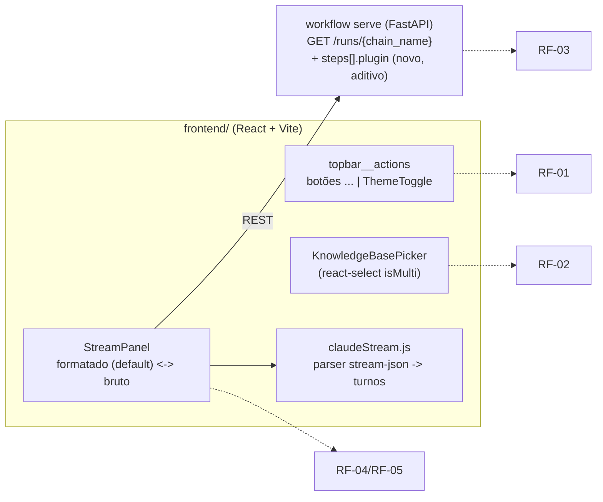

<!-- Front matter de relação: metadado que alimenta o grafo de dependências mantido
pela skill `blueprintfy` (scripts/graph_query.py). Use os nomes exatos das entradas do
CONTEXT-MAP.md em `contextos`/`afeta`. `supera` vai na ADR NOVA (a antiga é marcada
como superada pela ferramenta, não à mão). Mantenha os campos mesmo com lista vazia. -->

# ADR-010: Refinamentos de UX do painel — alternador de tema, Knowledge Bases e stream com leitura privilegiada por plataforma agêntica

- **Status**: Proposto
- **Data**: 2026-09-07
- **Autor**: Gerado a partir de demanda informal (elicitação via skill issue-to-adr)
- **PRD relacionado**: Nenhum — origem é uma demanda informal descrita em conversa, não um documento formal.

## Contexto

Três atritos de uso do painel (`frontend`, ADR-006/ADR-007/ADR-009) foram relatados
pelo usuário em conversa, sem PRD:

1. **Alternador de tema mal posicionado**: `ThemeToggle` fica intercalado entre os
   botões "Atualizar" e "Configurações" na `topbar` (`App.jsx`), competindo
   visualmente com ações da tela em vez de ser lido como uma preferência à parte.
2. **Multiselect de specs pouco usável e mal nomeado**: `SpecPicker` renderiza uma
   lista de checkboxes dentro de uma caixa com rolagem própria — ocupa espaço vertical
   fixo mesmo vazio, não tem busca, e usa o rótulo "Specs de referência", que descreve
   a origem técnica do dado (specs do repositório remoto de documentação) e não a
   intenção de uso: dar contexto de conhecimento para o agente. O usuário pediu
   explicitamente um controle no estilo `react-select` (combobox em barra, multi-seleção,
   busca embutida) rotulado **"Knowledge Bases"**.
3. **Stream ao vivo ilegível por padrão**: `StreamPanel` imprime cada linha bruta do
   `stream-json` do `claude` CLI (`plugins/claude_code_runner.py`) dentro de um único
   `<pre>` — o usuário vê JSON cru (`{"type":"assistant","message":{...}}`) em vez do
   texto da IA e das ferramentas usadas. Foi pedido que o painel (a) identifique, a
   partir do run/step, **qual plataforma agêntica foi acionada** (hoje, apenas
   `claude_code_runner`) e (b) privilegie por padrão uma leitura formatada
   (mensagens + rastros de ferramentas), mantendo o log bruto disponível por opção
   explícita — não como default.

**Assunções registradas (elicitação, análise de código antes de propor — sem rodada de
perguntas ao usuário, por já haver exemplo concreto de `react-select` e escopo claro):**
- Hoje existe uma única plataforma agêntica integrada (`claude_code_runner`, plugin
  Python que invoca o `claude` CLI em modo `stream-json`) — o desenho abaixo já nomeia
  a plataforma por `plugin`, mas não constrói suporte especulativo a outras: o
  fallback (log bruto) cobre qualquer `plugin` sem formatador dedicado.
- `docs_referenced`/`spec_multiselect` (ADR-007) continuam sendo o nome técnico do
  parâmetro e da fonte de dado — a renomeação para "Knowledge Bases" é de **rótulo
  visível ao usuário**, não do identificador interno (`param.name`, `source`,
  `specsClient.js`, nome de arquivo/componente `SpecPicker.jsx`). Alinhado ao
  princípio "small, reversible steps" da constitution: renomear identificadores
  internos sem necessidade funcional é custo sem benefício.
- `react-select` é aceito como nova dependência de runtime do frontend — não conflita
  com nenhuma restrição técnica da constitution (`React 19 + Vite 8, JavaScript`, sem
  framework de estilo imposto); é estilizado via `classNamePrefix` contra os tokens
  CSS já existentes (`src/index.css`), não via um design system próprio da lib.

## Requisitos atendidos

| ID | Requisito | Tipo |
|----|-----------|------|
| RF-01 | O alternador de tema claro/escuro/sistema fica visualmente separado do grupo de botões de ação da topbar, à direita deles — não mais intercalado | Funcional |
| RF-02 | O campo de referência de conhecimento do formulário de disparo é um combobox de multi-seleção em barra (estilo `react-select`), com busca, rotulado "Knowledge Bases" | Funcional |
| RF-03 | O stream ao vivo identifica, a partir do step em execução do run, qual plugin (plataforma agêntica) foi acionado | Funcional |
| RF-04 | Por padrão, o stream ao vivo do plugin `claude_code_runner` renderiza uma visão legível (texto da IA + rastros de ferramentas com status/detalhe), não o JSON bruto por linha | Funcional |
| RF-05 | O usuário pode alternar para ver o log bruto (comportamento anterior) a qualquer momento, para qualquer plugin | Funcional |
| RNF-01 | A mudança de contrato REST é aditiva e retrocompatível: `GET /runs/{chain_name}` ganha o campo `plugin` por etapa; nenhum campo existente muda de forma ou nome | Não-funcional |
| RNF-02 | Uma linha de stream que não seja JSON reconhecível, ou um `plugin` sem formatador dedicado, nunca quebra a tela — cai no log bruto para aquela linha/step | Não-funcional |

## Decisão

Três partes independentes entre si; só a terceira toca contrato REST.

- **RF-01 — Reposicionamento do `ThemeToggle`**: sai de entre os dois botões e passa a
  ser o último elemento de `topbar__actions`, com um separador visual (margem maior /
  divisor sutil) que o lê como "preferência", não como mais uma ação da lista. Puramente
  CSS/JSX (`App.jsx`, `index.css`) — sem novo estado, sem contrato.
- **RF-02 — `KnowledgeBasePicker` sobre `react-select`**: `SpecPicker.jsx` é reescrito
  usando `react-select` (`isMulti`, `classNamePrefix="select"`), continua consumindo
  `fetchSpecsIndex` (`specsClient.js`, inalterado — a fonte de dado não muda, só o
  widget). Estilizado só com CSS (sem `styled-components`), reaproveitando os tokens
  de `index.css` (`--accent`, `--border-strong`, `--radius-sm` etc.) via seletores
  `.select__*` do `classNamePrefix` — mantém o painel visualmente consistente sem
  adotar um design system externo. O rótulo visível passa a ser **"Knowledge Bases"**
  em dois lugares: o `label` do parâmetro no template YAML
  (`backend/config/workflow_templates/claude-implementar-local.yaml`,
  `docs_referenced.label`) e os textos internos do próprio picker (carregando/vazio/erro).
  `param.name` (`docs_referenced`), `source` (`spec_multiselect`) e o payload enviado ao
  motor **não mudam** — é troca de rótulo e de widget, não de contrato.
- **RF-03/RF-04/RF-05 — Stream com leitura privilegiada por plataforma**: `GET
  /runs/{chain_name}` passa a incluir `plugin: string` em cada item de `steps[]`,
  resolvido a partir do `config_path` já persistido em `workflow_runs` (mesma técnica
  já usada por `_resolve_active_claude_step`, `http_api.py`, ADR-005) — nenhuma coluna
  nova no SQLite, nenhuma escrita nova, só leitura adicional do YAML da chain ao montar
  a resposta. `RunDetail.jsx` identifica a etapa em execução (`status === 'running'`) e
  repassa seu `plugin` para `StreamPanel`. `StreamPanel` escolhe o formatador pelo
  `plugin` via um registro pequeno (`{claude_code_runner: parseClaudeStream}`); sem
  formatador conhecido (ou linha não-JSON), cai no log bruto — o mesmo componente que
  hoje já existe, preservado como modo explícito, nunca removido. Para
  `claude_code_runner`, `claudeStream.js` interpreta cada linha `stream-json` (`type`:
  `system`/`user`/`assistant`/`result`, blocos `text`/`tool_use`/`tool_result` do
  `message.content`) e produz turnos: texto da IA como prosa, chamada de ferramenta
  como rastro rotulado (nome + status: executando/concluído/falhou + detalhe
  expansível com entrada/saída), evento final como um resumo de encerramento
  (sucesso/erro). Um alternador "Ver log bruto" no cabeçalho do painel troca para o
  `<pre>` já existente — nunca removido, sempre disponível independente do `plugin`.

## Alternativas consideradas

| Alternativa | Por que não foi escolhida |
|-------------|---------------------------|
| Detectar a plataforma agêntica só no frontend, inspecionando a primeira linha do stream | A primeira linha só chega depois de o stream abrir — o painel precisaria escolher um formatador às cegas ou esperar; expor `plugin` no `GET /runs/{chain_name}` (já carregado antes do stream, para montar a tabela de etapas) resolve isso sem espera e sem heurística sobre o conteúdo do stream. |
| Endpoint novo `GET /runs/{chain_name}/plugins` só para essa informação | Contrato adicional para um dado que já cabe, aditivamente, na resposta existente — mais uma rota para o mesmo propósito é complexidade sem benefício (mesmo raciocínio de "aditivo sobre existente" da ADR-009). |
| Biblioteca de markdown/streaming genérica (ex.: renderer de chat completo) para a leitura formatada | Escopo maior que o pedido: o stream aqui é de um `claude` CLI já estruturado (`stream-json`), não texto livre a re-interpretar; um parser dedicado ao formato conhecido é mais simples e mais previsível que adotar uma lib de chat genérica. |
| Manter a lista de checkboxes e só trocar o rótulo para "Knowledge Bases" | Não atende ao pedido explícito — o usuário quer o padrão de interação de combobox em barra (`react-select`), não só a palavra nova. |
| Renomear também os identificadores internos (`docs_referenced`, `spec_multiselect`, arquivo `SpecPicker.jsx`) | Custo de diff maior sem ganho funcional — o usuário pediu como o campo **aparece**, não como o motor referencia o parâmetro internamente; alinhado a "small, reversible steps". |

## Consequências

- **Positivas**: o alternador de tema para de competir visualmente com ações da tela;
  o seletor de conhecimento ganha busca e ocupa menos espaço vertical parado, com um
  nome que descreve a intenção de uso; o stream ao vivo deixa de exigir que o usuário
  leia JSON para acompanhar o que o agente está fazendo, sem perder a opção de
  auditoria em log bruto; o contrato REST cresce de forma aditiva, então nenhum
  consumidor atual quebra.
- **Negativas / trade-offs**: `react-select` é uma dependência de runtime nova (bundle
  maior que um `<ul>` de checkboxes) — aceito porque é exatamente o padrão de
  interação pedido, e o projeto já não tinha restrição contra bibliotecas de UI. O
  parser de `claudeStream.js` conhece a forma do `stream-json` do `claude` CLI
  verificada em `plugins/claude_code_runner.py` (ADR-005) — se essa forma mudar em uma
  versão futura do CLI, o parser degrada para o fallback de log bruto por linha não
  reconhecida (RNF-02), nunca quebra a tela, mas a leitura formatada para uma linha
  específica pode ficar incompleta até o parser ser atualizado.
- **Riscos**: nenhum risco de segurança novo — `plugin` é o mesmo dado que
  `_resolve_active_claude_step` já lê do YAML da chain para decidir se um step é
  "streamável" (ADR-005); só passa a ser exposto também na resposta de detalhe do run.

## Componentes afetados

- Frontend App (`frontend/`, ADR-006/ADR-007) — `App.jsx`/`index.css`
  (reposicionamento do `ThemeToggle`); `SpecPicker.jsx` reescrito sobre `react-select`
  (RF-02); `StreamPanel.jsx` (alternância formatado/bruto), novo `lib/claudeStream.js`
  (parser), `RunDetail.jsx` (repassa `plugin` do step em execução); `package.json`
  (dependência `react-select`).
- Template de workflow (`backend/config/workflow_templates/claude-implementar-local.yaml`,
  ADR-007/ADR-008) — `docs_referenced.label` passa de "Specs de referência" para
  "Knowledge Bases".
- API HTTP (`backend/src/workflow_engine/adapters/http_api.py`, ADR-004/ADR-005) —
  `get_run_detail` passa a incluir `plugin` por item de `steps[]`, resolvido do YAML da
  chain via `config_path` já persistido; nenhuma rota, payload existente ou contrato de
  erro muda.

> Atividades e Acceptance Criteria detalhadas estão em `ADR-010-acs.md`.
