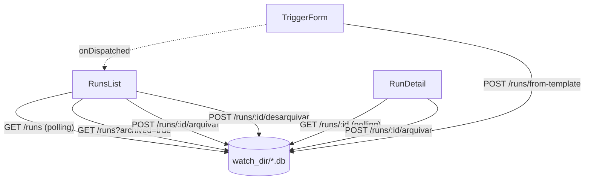

# ADR-011: Atualização automática do painel/detalhe de execuções + arquivamento

- **Status**: Aceito
- **Data**: 2026-09-07
- **Autor**: gerado a partir de demanda informal do usuário (skill `issue-to-adr`)
- **PRD relacionado**: nenhum — demanda em chat, sem documento formal

## Contexto

Três atritos relatados pelo usuário em conversa (elicitado via skill `issue-to-adr`,
sem PRD):

1. Ao disparar uma execução, o painel de execuções (`RunsList`) só reflete o novo run
   e seu avanço de status através de um clique manual em "Atualizar" — não há
   atualização automática enquanto a execução progride.
2. A tela de detalhe (`RunDetail`) busca `GET /runs/{chain_name}` uma única vez, ao
   entrar na tela. O botão "Atualizar" hoje existente ali só reconecta o stream ao
   vivo (`StreamPanel`) — não refaz a busca do detalhe — então a tabela de etapas e o
   status geral do run ficam parados mesmo com a execução avançando de verdade.
3. O painel acumula execuções concluídas/antigas sem forma de tirá-las de vista;
   usuário quer "arquivar" para reduzir ruído sem perder o histórico (nem apagar o
   `.db` da execução).

**Assunções registradas na elicitação** (1 rodada, 2 perguntas fechadas — ver
checklist da skill): o usuário decidiu explicitamente, antes de qualquer código, que
(a) o estado de "arquivada" deve **persistir no backend** (não em `localStorage`),
sobrevivendo a troca de navegador/dispositivo, e que (b) o arquivamento deve ser
**reversível**, com um filtro "Arquivadas" na mesma tela e uma ação de desarquivar —
não é uma exclusão disfarçada.

## Requisitos atendidos

| ID | Requisito | Tipo |
|----|-----------|------|
| RF-01 | `RunsList` atualiza sozinha (sem exigir clique) enquanto houver execução não-terminal na lista, cobrindo o momento logo após um disparo | Funcional |
| RF-02 | `RunDetail` atualiza sozinha o status geral e a tabela de etapas enquanto o run estiver `running`/`pending`, refletindo avanço de etapa sem refresh manual | Funcional |
| RF-03 | Usuário arquiva uma execução a partir da listagem ou do detalhe; ela some da listagem padrão | Funcional |
| RF-04 | Usuário vê e desarquiva execuções arquivadas via um filtro "Arquivadas" na mesma tela | Funcional |
| RNF-01 | Arquivar/desarquivar nunca apaga o `.db`/histórico da execução — é só visibilidade | Não-funcional |
| RNF-02 | Sem mecanismo de push novo (SSE/WebSocket) para lista/detalhe — reaproveita `GET /runs`/`GET /runs/{chain_name}` existentes via polling simples, consistente com o volume baixo já assumido nas ADRs anteriores (uso local individual) | Não-funcional |

## Decisão

**Backend (`motor-workflow`)** — arquivar é modelado como um campo novo,
`archived_at` (nullable), no **mesmo arquivo SQLite por chain** (`<chain_name>.db`)
que já guarda `workflow_runs`/`step_executions` — não um índice separado, não um
campo no `StateStorePort`. Isso segue exatamente a mesma decisão de desacoplamento já
tomada na ADR-004 (`GET /runs`/`GET /runs/{chain_name}` leem os `.db` direto via
`sqlite3`, sem depender de quem criou a execução): arquivar é um estado de
monitoria/UI, então é lido e escrito direto via `sqlite3`, fora do
`StateStorePort` — igual ao padrão de leitura que já existe hoje.

`ALTER TABLE workflow_runs ADD COLUMN archived_at TEXT` é aditivo e idempotente
(tentado a cada escrita/leitura de arquivamento, erro de "coluna já existe"
silenciado) — cobre tanto `.db` novos (criados após esta feature) quanto os já
existentes hoje, sem migração manual.

Duas rotas novas, mesmo contrato de erro já usado por `cancelar` (404
`{"error": {"code": "not_found", ...}}` para `chain_name` desconhecido):

- `POST /runs/{chain_name}/arquivar` — idempotente, seta `archived_at = now()`.
- `POST /runs/{chain_name}/desarquivar` — idempotente, seta `archived_at = NULL`.

`GET /runs` ganha `?archived=true` opcional (aditivo, retrocompatível — mesmo padrão
do `?root=` da ADR-009): sem o parâmetro, retorna só execuções **não** arquivadas
(comportamento de hoje, preservado); com `archived=true`, retorna só as arquivadas.
`GET /runs/{chain_name}` passa a incluir `archived` (bool) no corpo (aditivo) — uma
execução arquivada continua acessível pelo detalhe, mesmo fora da listagem padrão.

**Frontend** — `RunsList` e `RunDetail` passam a fazer *polling* simples
(`setInterval`, não uma nova primitiva) enquanto houver algo para observar:

- `RunsList`: enquanto a contagem de `running`/`pending` na resposta atual for > 0,
  reconsulta `GET /runs` a cada poucos segundos; para quando não há mais nada ativo.
  O `refreshToken`/botão "Atualizar" (ADR-006) continuam existindo para o disparo
  manual e para o momento do disparo (`TriggerForm.onDispatched`) — o polling é
  aditivo, não substitui esse caminho.
- `RunDetail`: enquanto `detail.status` for `running`/`pending`, reconsulta
  `GET /runs/{chain_name}` no mesmo intervalo — atualiza a tabela de etapas e o
  status geral. `StreamPanel` (stream ao vivo por etapa, ADR-005/ADR-010) não muda:
  continua com seu próprio mecanismo de SSE, independente deste polling.
- Nova aba/filtro "Arquivadas" na `summary-strip` de `RunsList` (mesmo padrão dos
  cards de status já existentes, ADR-006-AC-04), consultando
  `GET /runs?archived=true`. Ação "Arquivar"/"Desarquivar" por linha (lista) e no
  cabeçalho do detalhe (`RunDetail`).

## Alternativas consideradas

| Alternativa | Por que não foi escolhida |
|-------------|---------------------------|
| SSE/WebSocket dedicado para lista e/ou detalhe | Exige rota nova mais complexa (canal por cliente, fan-out) para um ganho que não se justifica num app local de uso individual — o mesmo raciocínio de RNF-02 das ADRs anteriores (volume baixo). Polling de poucos segundos resolve com muito menos superfície nova. |
| Arquivar em `localStorage` | Rejeitada explicitamente pelo usuário na elicitação — precisa sobreviver a troca de navegador/dispositivo. |
| Arquivar apagando o `.db` da execução | Perde histórico/evidência de execução; usuário pediu "não aparecer na tela", não "apagar". |
| Campo de arquivamento num índice/arquivo separado (ex.: `_archived.json` no `watch_dir`) | Mais um formato de arquivo para manter sincronizado com a existência dos `.db`; o campo na própria linha de `workflow_runs` já é a fonte única de verdade por execução, sem risco de os dois arquivos divergirem. |

## Consequências

- **Positivas**: painel e detalhe deixam de exigir clique manual para refletir
  progresso real; arquivamento reduz ruído sem perder histórico nem exigir
  autenticação/multiusuário.
- **Negativas / trade-offs**: polling gera requisições HTTP periódicas extras
  enquanto há execução ativa (aceitável — mesmo raciocínio de volume baixo já
  assumido; intervalo poucos segundos, nunca sub-segundo); telas precisam limpar o
  `setInterval` ao desmontar/trocar de run para não vazar timers.
- **Riscos**: `ALTER TABLE` num `.db` corrompido ou de formato inesperado poderia
  lançar um erro diferente de "coluna já existe" — mitigado tratando qualquer
  `sqlite3.OperationalError` na migração como não-fatal para leitura (mesma postura
  de degradação graciosa já usada em `_step_plugins_by_name`, ADR-010).

## Componentes afetados

- `backend/src/workflow_engine/adapters/http_api.py` (`list_runs`, `get_run_detail`,
  rotas `arquivar`/`desarquivar`, `?archived=`)
- `backend/tests/test_http_api.py`
- `frontend/src/lib/apiClient.js` (`archiveRun`, `unarchiveRun`, `getRuns(archived)`)
- `frontend/src/components/RunsList.jsx` (polling, filtro "Arquivadas", ação por linha)
- `frontend/src/components/RunDetail.jsx` (polling, ação arquivar/desarquivar)
- `frontend/src/App.jsx` (nenhuma mudança estrutural esperada — `refreshToken`
  continua igual)

> Atividades e Acceptance Criteria detalhadas estão em `ADR-011-acs.md`.
