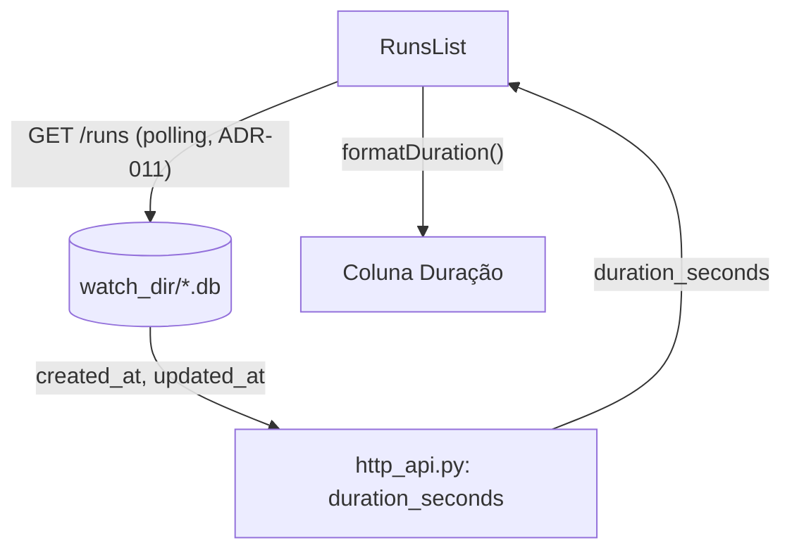

# ADR-012: Tempo de execução na tabela de execuções

- **Status**: Aceito
- **Data**: 2026-09-07
- **Autor**: gerado a partir de demanda em chat (sem skill de elicitação formal, sem PRD)
- **PRD relacionado**: nenhum — demanda em chat

## Contexto

Usuário pediu para verificar se já seria possível trazer o "tempo de execução" de cada
workflow para a tabela do painel de controle (`RunsList`), a partir do dado que já
existe na base. Investigação (duas explorações, backend e frontend) confirmou que sim:
o backend já persiste, por execução, `created_at` (início) e `updated_at` (última
mudança de status — coincide com o fim quando o status é terminal) na tabela
`workflow_runs` do SQLite por chain (`sqlite_state_store.py`), já lidos e devolvidos
por `GET /runs`/`GET /runs/{chain_name}` (`http_api.py`), mas nunca subtraídos nem
expostos como duração. O frontend, por sua vez, não tem nenhum formatador de duração
nem coluna correspondente na tabela hoje.

Ou seja: não é necessária nenhuma nova instrumentação, coluna de armazenamento ou
evento — só calcular a diferença entre timestamps já existentes, expor um campo
aditivo na API, e renderizar no frontend. Mesmo padrão de "contrato novo do lado
motor-workflow pequeno o bastante para não abrir spec própria nesse contexto,
documentado no plan.md desta feature", já usado nas ADR-010/ADR-011.

## Requisitos atendidos

| ID | Requisito | Tipo |
|----|-----------|------|
| RF-01 | A tabela de execuções mostra, por execução, o tempo total gasto (duração) | Funcional |
| RF-02 | Para uma execução em andamento, a duração mostrada reflete o tempo decorrido até agora, e aumenta enquanto a tela já atualiza sozinha (polling herdado da ADR-011) | Funcional |
| RF-03 | Para uma execução terminada, a duração mostrada é fixa: o tempo total do início ao fim | Funcional |
| RNF-01 | Sem nova instrumentação/coluna de armazenamento — usa apenas `created_at`/`updated_at` já persistidos | Não-funcional |
| RNF-02 | Mudança de contrato da API é aditiva e retrocompatível | Não-funcional |
| RNF-03 | Sem novo mecanismo de atualização automática — reaproveita o polling já existente da ADR-011 | Não-funcional |

## Decisão

**Backend (`motor-workflow`)** — `duration_seconds` (inteiro, segundos, ou `null`)
calculado **inline em `http_api.py`**, na mesma camada que já lê `created_at`/
`updated_at` do SQLite via `sqlite3` (mesmo padrão de desacoplamento de `list_runs`/
`get_run_detail`, ADR-004) — sem tocar `StateStorePort`/`SqliteStateStore`, sem novo
modelo Pydantic (os dois endpoints já retornam dicts simples hoje).

Regra de cálculo:
- Status terminal (diferente de `running`/`pending`): `duration_seconds = updated_at -
  created_at` — valor fixo, exato, porque `updated_at` foi escrito pela última vez
  exatamente na transição para o status terminal.
- Status `running`/`pending`: `duration_seconds = now() - created_at`, recalculado a
  cada request — necessário porque `updated_at` fica parado no último step concluído
  enquanto a execução está ativa (não é "agora"). Isso significa que o valor cresce
  sozinho a cada nova consulta, sem precisar de nenhum mecanismo de push: o polling já
  existente de `RunsList` (ADR-011, a cada poucos segundos enquanto há execução ativa)
  já cobre a atualização visual.
- `created_at`/`updated_at` ausente ou não-parseável: `duration_seconds: null`, sem
  erro — mesma postura de degradação graciosa já usada por `_step_plugins_by_name`
  (ADR-010).

`GET /runs` e `GET /runs/{chain_name}` ganham o campo (aditivo, retrocompatível — mesma
garantia dada por `archived`/`plugin` nas ADRs anteriores). Duração por step em
`GET /runs/{chain_name}` (a partir de `started_at`/`finished_at` de `step_executions`,
dado igualmente disponível) fica fora de escopo desta feature — ver Alternativas.

**Frontend** — nova coluna "Duração" em `RunsList.jsx`, entre "Status" e "Atualizado",
lendo `run.duration_seconds` e formatando via um novo `formatDuration(seconds)` em
`lib/format.js` (formato compacto pt-BR: `"45s"`, `"2min 14s"`, `"1h 03min"`). Sem
mecanismo de atualização novo: a coluna se beneficia do polling que `RunsList` já faz
(ADR-011) sempre que há execução `running`/`pending` na resposta.

## Alternativas consideradas

| Alternativa | Por que não foi escolhida |
|-------------|---------------------------|
| Duração também por step em `RunDetail` (tabela de etapas) | Escopo pedido pelo usuário foi explicitamente "a tabela" (listagem); `RunDetail` já ignora `started_at`/`finished_at` hoje, então isso exigiria desenho de coluna própria numa tela separada. Deferido — dado já é exposto por `get_run_detail` hoje (`started_at`/`finished_at` por step), então fica pronto para uma extensão futura sem mudança de contrato. |
| Calcular duração no frontend a partir de `created_at`/`updated_at` já expostos | Duplicaria a mesma regra condicional (terminal vs. em andamento, incluindo `now()`) em dois lugares e exigiria parsing de data no cliente para um valor que o servidor já tem prontamente disponível; centralizar no backend mantém uma única fonte de verdade, como já é o padrão desta API (`archived`, `plugin`). |
| Novo campo estruturado (`{seconds, formatted}`) em vez de só `duration_seconds` numérico | Formatação/idioma (pt-BR) é responsabilidade de apresentação do frontend, não do backend — mesmo raciocínio já aplicado a `created_at`/`updated_at` (ISO cru, formatado só no cliente via `formatRelativeTime`/`formatAbsoluteTime`). |

## Consequências

- **Positivas**: usuário vê quanto tempo cada execução levou/está levando sem nenhuma
  instrumentação nova; consistente com o padrão já usado por `archived`/`plugin`
  (campo aditivo, calculado na borda de leitura).
- **Negativas / trade-offs**: nenhuma — é leitura pura sobre dado já persistido, sem
  nova escrita, sem nova rota, sem novo polling.
- **Riscos**: nenhum identificado além dos já cobertos pela ADR-011 (`ALTER TABLE`
  degradado graciosamente não se aplica aqui, pois não há coluna nova).

## Componentes afetados

- `backend/src/workflow_engine/adapters/http_api.py` (`list_runs`, `get_run_detail`)
- `backend/tests/test_http_api.py`
- `frontend/src/lib/format.js` (`formatDuration`, novo)
- `frontend/src/components/RunsList.jsx` (nova coluna "Duração")
- `frontend/src/components/RunsList.test.jsx`
- `frontend/src/index.css` (`.col-duration`)

> Atividades e Acceptance Criteria detalhadas estão em `ADR-012-acs.md`.
